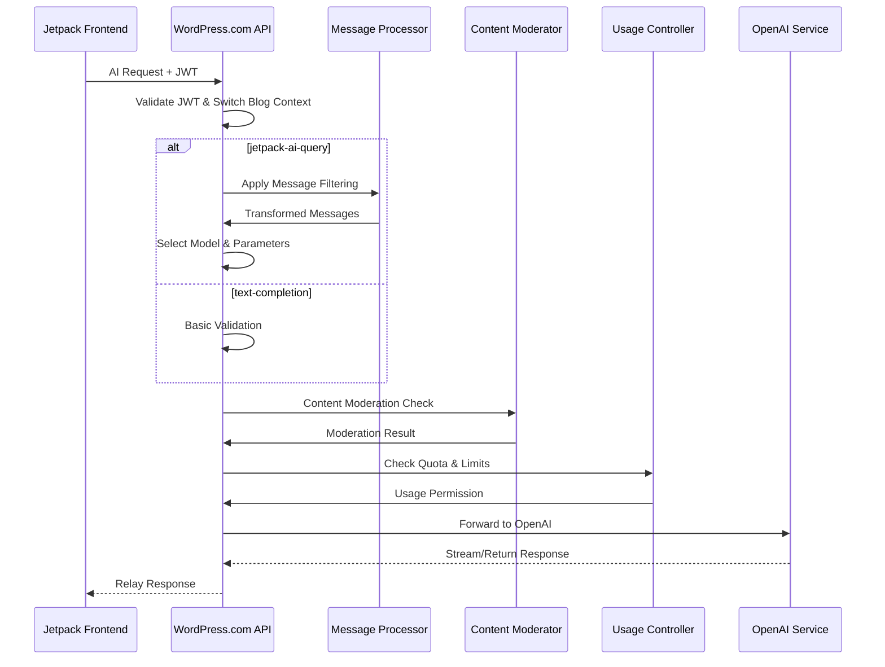
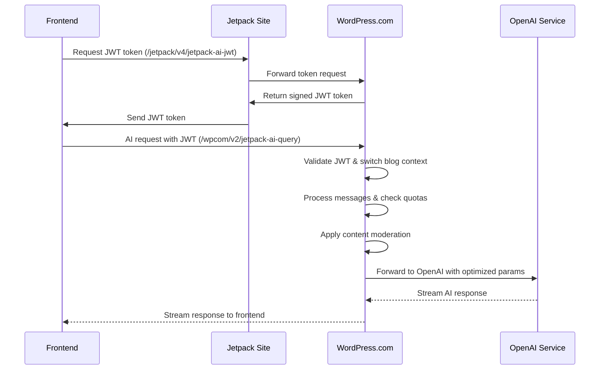

# Jetpack AI Assistant Architecture Guide

## Overview

The Jetpack AI Assistant is a comprehensive AI-powered content creation system integrated into WordPress through the Jetpack plugin. It provides various AI features including content generation, image creation, proofreading, SEO optimization, and more. This document maps out the architecture and explains how all the components work together.

## Project Development

This architecture documentation is based on the comprehensive [Jetpack AI Project](https://github.com/orgs/Automattic/projects/667/views/1) that coordinated the development of all AI features across the Jetpack ecosystem. The project board tracks the implementation of various AI capabilities, from the core client infrastructure to specific features like SEO enhancement and content generation.

**Project Status Overview:**
- **Active Development**: Ongoing implementation and refinement of AI features
- **Cross-Team Coordination**: Involves multiple teams working on different components
- **Feature Prioritization**: Tracks critical AI features and their development status
- **Quality Assurance**: Monitors testing and deployment of AI capabilities

The project encompasses the development of all components documented in this architecture guide, including the core AI client package, individual AI blocks, the plugin ecosystem, and the WordPress.com backend infrastructure that powers the AI services.

## Architecture Overview

The following diagram illustrates the complete Jetpack AI Assistant architecture, showing how all components interact from the frontend JavaScript client through the WordPress.com LLM gateway to the OpenAI services:

```mermaid
graph TB
    %% Core AI Client Package
    subgraph "AI Client Package (@automattic/jetpack-ai-client)"
        JWT[JWT Token Manager]
        SuggestionsES[SuggestionsEventSource]
        AskQuestion[askQuestion API]
        DataFlow[Data Flow Context]
        AIControl[AI Control Components]
        Hooks[React Hooks]
        Components[Reusable Components]
    end

    %% Main AI Assistant Block
    subgraph "AI Assistant Block"
        AIBlock[AI Assistant Block]
        AIEdit[Block Edit Component]
        Prompts[Prompt System]
        Transforms[Block Transforms]
        Extensions[Text Block Extensions]
    end

    %% AI Assistant Plugin
    subgraph "AI Assistant Plugin"
        PluginSidebar[Plugin Sidebar]
        
        subgraph "Features"
            UsagePanel[Usage Panel]
            TitleOpt[Title Optimization]
            SEOEnhancer[SEO Enhancer]
            Breve[Breve Proofreading]
            FeaturedImg[Featured Image Gen]
            Feedback[AI Feedback]
        end
    end

    %% Other AI Blocks
    subgraph "Additional AI Blocks"
        AIChat[AI Chat Block]
        VoiceToContent[Voice to Content]
        AIContentLens[AI Content Lens]
    end

    %% Backend Services - Updated with WordPress.com endpoints
    subgraph "Backend & API Layer"
        subgraph "Jetpack Site APIs"
            JWTEndpoint[JWT Token Endpoint<br/>/jetpack/v4/jetpack-ai-jwt]
        end
        
        subgraph "WordPress.com LLM Gateway"
            JetpackAIQuery[Main AI Endpoint<br/>/wpcom/v2/jetpack-ai-query<br/>- Message Processing<br/>- Model Selection<br/>- Usage Enforcement]
            TextCompletion[Text Completion<br/>/wpcom/v2/text-completion<br/>- Basic Completion<br/>- Streaming Support]
            MessageProcessing[Message Filtering & Validation]
            ContentModeration[OpenAI Content Moderation]
            UsageEnforcement[Quota & Plan Limits]
        end
        
        subgraph "AI Services"
            GPT4o[OpenAI GPT-4o<br/>Advanced Features]
            GPT4oMini[OpenAI GPT-4o-mini<br/>Standard Features]
        end
    end

    %% My Jetpack Integration
    subgraph "My Jetpack"
        AIProduct[AI Product Class]
        Plans[Plan Management]
        Checkout[Checkout Integration]
    end

    %% Connections and Data Flow
    AIBlock --> AIClient
    AIEdit --> DataFlow
    AIEdit --> Prompts
    
    PluginSidebar --> UsagePanel
    PluginSidebar --> TitleOpt
    PluginSidebar --> SEOEnhancer
    PluginSidebar --> Breve
    PluginSidebar --> FeaturedImg
    
    %% Authentication Flow
    JWT --> JWTEndpoint
    JWTEndpoint --> JetpackAIQuery
    
    %% AI Request Flow
    AskQuestion --> SuggestionsES
    SuggestionsES --> JetpackAIQuery
    SuggestionsES --> TextCompletion
    
    %% WordPress.com Processing Pipeline
    JetpackAIQuery --> MessageProcessing
    JetpackAIQuery --> ContentModeration
    JetpackAIQuery --> UsageEnforcement
    TextCompletion --> ContentModeration
    TextCompletion --> UsageEnforcement
    
    %% Model Selection & AI Service
    JetpackAIQuery --> GPT4o
    JetpackAIQuery --> GPT4oMini
    TextCompletion --> GPT4oMini
    
    %% Feature-specific routing
    AIChat --> JetpackAIQuery
    VoiceToContent --> JetpackAIQuery
    AIContentLens --> JetpackAIQuery
    TitleOpt --> JetpackAIQuery
    SEOEnhancer --> JetpackAIQuery
    Breve --> JetpackAIQuery
    
    %% Usage tracking
    UsagePanel --> AIProduct
    AIProduct --> Plans
    Plans --> Checkout
    UsageEnforcement --> AIProduct

    %% Feature-specific model assignments
    Breve -.->|Uses GPT-4o| GPT4o
    SEOEnhancer -.->|Uses GPT-4o-mini + JSON| GPT4oMini
    TitleOpt -.->|Uses GPT-4o-mini| GPT4oMini
    VoiceToContent -.->|Uses GPT-4o-mini| GPT4oMini

    classDef corePackage fill:#e1f5fe
    classDef blockComponent fill:#f3e5f5
    classDef pluginFeature fill:#e8f5e8
    classDef jetpackAPI fill:#fff8e1
    classDef wpcomAPI fill:#fff3e0
    classDef aiService fill:#fce4ec
    classDef integration fill:#f1f8e9

    class JWT,SuggestionsES,AskQuestion,DataFlow,AIControl,Hooks,Components corePackage
    class AIBlock,AIEdit,Prompts,Transforms,Extensions,AIChat,VoiceToContent,AIContentLens blockComponent
    class PluginSidebar,UsagePanel,TitleOpt,SEOEnhancer,Breve,FeaturedImg,Feedback pluginFeature
    class JWTEndpoint jetpackAPI
    class JetpackAIQuery,TextCompletion,MessageProcessing,ContentModeration,UsageEnforcement wpcomAPI
    class GPT4o,GPT4oMini aiService
    class AIProduct,Plans,Checkout integration
```



## Core Architecture Components

### 1. AI Client Package (`@automattic/jetpack-ai-client`)

**Location**: [`projects/js-packages/ai-client/`](https://github.com/Automattic/jetpack/tree/trunk/projects/js-packages/ai-client)

This is the foundational package that provides the core AI functionality across all Jetpack AI features.

#### Key Components:

- **JWT Token Manager** (`src/jwt/`): Handles authentication with WordPress.com AI services
  - Manages token acquisition, caching, and renewal
  - Supports both self-hosted Jetpack sites and WordPress.com sites
  - Endpoint: `/jetpack/v4/jetpack-ai-jwt`

- **SuggestionsEventSource** (`src/suggestions-event-source/`): Manages streaming AI responses
  - EventTarget-based implementation for real-time AI suggestion streaming
  - Handles server-sent events from the AI API

- **askQuestion API** (`src/ask-question/`): Core API for AI requests
  - Synchronous and asynchronous variants
  - Handles prompt building and response parsing
  - Returns SuggestionsEventSource instances for streaming

- **Data Flow Context** (`src/data-flow/`): React context for AI state management
  - Provides `withAiAssistantData` HOC and `useAiContext` hook
  - Manages suggestion state, loading state, and error handling
  - Centralizes AI functionality across components

- **React Hooks** (`src/hooks/`):
  - `useAiSuggestions`: Core hook for AI request management
  - `useAiFeature`: Feature availability and quota management
  - `useImageGenerator`: AI image generation
  - `useAudioTranscription`: Voice-to-text functionality
  - `useMediaRecording`: Audio recording capabilities

- **Reusable Components** (`src/components/`):
  - `AIControl`: Universal AI control interface
  - `AiStatusIndicator`: Loading and status indicators
  - `AIImage`: Image generation components
  - `Modal`: AI-specific modal dialogs

### 2. AI Assistant Block

**Location**: [`projects/plugins/jetpack/extensions/blocks/ai-assistant/`](https://github.com/Automattic/jetpack/tree/trunk/projects/plugins/jetpack/extensions/blocks/ai-assistant)

The main Gutenberg block for AI content generation.

#### Key Features:

- **Content Generation**: Generate blog posts, lists, tables from prompts
- **Content Editing**: Modify tone, simplify, expand, correct spelling
- **Multiple Prompt Types**: Predefined prompt types for common use cases
- **Block Transforms**: Convert other blocks to/from AI Assistant blocks
- **Text Block Extensions**: Add AI capabilities to existing text blocks

#### Architecture:

```typescript
// Block registration
{
  "name": "jetpack/ai-assistant",
  "title": "AI Assistant", 
  "category": "text",
  "supports": {
    "html": false,
    "multiple": true,
    "reusable": false
  }
}
```

**Prompt System** (`lib/prompt/`):
- Backend prompt building with context-aware message construction
- Support for 17+ prompt types including user prompts, tone changes, language translation
- Structured message format for consistent AI responses

### 3. AI Assistant Plugin

**Location**: [`projects/plugins/jetpack/extensions/plugins/ai-assistant-plugin/`](https://github.com/Automattic/jetpack/tree/trunk/projects/plugins/jetpack/extensions/plugins/ai-assistant-plugin)

Provides additional AI features through a unified sidebar interface.

#### Plugin Structure:

```javascript
// Plugin registration
export const name = 'ai-assistant-plugin';
export const settings = {
  render: AiAssistantPluginSidebar,
};
```

#### Core Features:

##### **Usage Panel** (`components/usage-panel/`)
- Displays current AI request quota usage
- Shows plan limits and upgrade options
- Tracks request counts and provides usage analytics

##### **Title Optimization** (`components/title-optimization/`)
- AI-powered post title generation and optimization
- SEO-focused title suggestions
- Keyword integration support

##### **SEO Enhancer** (`components/seo-enhancer/`)
- Automated SEO metadata generation
- Meta description creation
- Image alt-text generation
- Auto-generation on publish workflow

##### **Breve Proofreading** (`components/breve/`)
- Advanced text analysis and proofreading
- Features:
  - Long sentence detection
  - Complex word identification
  - Spelling mistake correction
  - Unconfident word detection
- Custom dictionary support for brands, technical terms
- Flesch-Kincaid readability scoring

##### **Featured Image Generator** (Referenced in sidebar)
- AI-generated featured images from post content
- Custom prompt-based image creation

### 4. Additional AI Blocks

#### **AI Chat Block** ([`extensions/blocks/ai-chat/`](https://github.com/Automattic/jetpack/tree/trunk/projects/plugins/jetpack/extensions/blocks/ai-chat))
- Interactive chat interface for site visitors
- Integrates with Jetpack Search for context-aware responses
- Configurable display options (copy, feedback, sources)

#### **Voice to Content Block** ([`extensions/blocks/voice-to-content/`](https://github.com/Automattic/jetpack/tree/trunk/projects/plugins/jetpack/extensions/blocks/voice-to-content))
- Audio recording and transcription capabilities
- Converts speech to text using AI transcription services
- Audio status indicators and controls

#### **AI Content Lens** ([`extensions/plugins/ai-content-lens/`](https://github.com/Automattic/jetpack/tree/trunk/projects/plugins/jetpack/extensions/plugins/ai-content-lens))
- AI-powered post excerpt generation
- Content analysis and enhancement

### 5. Backend Architecture

#### **REST API Endpoints**

##### **Jetpack Site Endpoints** (Token Management)

**Primary Endpoint**: `/jetpack/v4/jetpack-ai-jwt`
- **Purpose**: JWT token acquisition for AI service authentication
- **Method**: POST
- **Permission**: Connected user with `edit_posts` capability
- **Implementation**: [`projects/packages/my-jetpack/src/class-rest-ai.php`](https://github.com/Automattic/jetpack/blob/trunk/projects/packages/my-jetpack/src/class-rest-ai.php)

##### **WordPress.com API Endpoints** (LLM Gateway)

The WordPress.com platform provides multiple AI endpoints serving different use cases:

**Core AI Endpoint**: `/wpcom/v2/jetpack-ai-query` (Advanced AI Gateway)
- **Purpose**: Main AI completion API with advanced message processing
- **Location**: [`wpcom/wp-content/rest-api-plugins/endpoints/jetpack-ai-query.php`](https://github.a8c.com/Automattic/wpcom/blob/trunk/wp-content/rest-api-plugins/endpoints/jetpack-ai-query.php)
- **Methods**: GET, POST
- **Authentication**: JWT Bearer token
- **Advanced Features**:
  - **Intelligent Message Processing**: Sophisticated preprocessing pipeline that transforms Jetpack-specific message formats into OpenAI-compatible requests
  - **Feature-Aware Model Selection**: Automatically selects optimal models (GPT-4o vs GPT-4o-mini) based on feature requirements
  - **Context-Aware Parameters**: Dynamic `max_tokens`, `temperature`, and `response_format` based on use case
  - **Comprehensive Quota Management**: Multi-tier usage tracking with plan-specific limits
  - **Content Safety**: Integrated OpenAI moderation with feature-specific handling
  - **Streaming and non-streaming responses**
  - **Function/tool calling support**
  - **JSON response format support**

**Text Completion Endpoint**: `/wpcom/v2/text-completion` (Simple Completion API)
- **Purpose**: Simpler text completion API for basic use cases
- **Location**: [`wpcom/wp-content/rest-api-plugins/endpoints/ai-text-completion.php`](https://github.a8c.com/Automattic/wpcom/blob/trunk/wp-content/rest-api-plugins/endpoints/ai-text-completion.php)
- **Methods**: POST
- **Authentication**: JWT token
- **Simple Features**:
  - **Basic Prompt Completion**: Direct text-in, text-out interface
  - **Streaming Support**: Real-time response streaming via `/text-completion/stream`
  - **Function Calling**: Support for OpenAI function/tool definitions
  - **Parameter Control**: Direct control over `temperature`, `seed`, `model`
- **Use Cases**: Simple text completion tasks, third-party integrations, legacy compatibility, testing and development

##### **Public API Endpoints** (External Access)

**Completions REST Endpoint**:
- **URL**: `https://public-api.wordpress.com/wpcom/v2/sites/jetpack-ai/completions`
- **Purpose**: Text completion based on OpenAI's chat completion API
- **Authentication**: Cookie-based
- **Method**: POST

**Image Generation REST Endpoint**:
- **URL**: `https://public-api.wordpress.com/wpcom/v2/jetpack-ai/images/generations`
- **Purpose**: Generate images from text prompts using DALL·E
- **Authentication**: Cookie-based
- **Method**: POST

**JWT Token Acquisition**:
- **URL**: `/wpcom/v2/sites/{siteSuffix}/jetpack-openai-query/jwt`
- **Purpose**: Acquire JWT tokens for streaming completions
- **Authentication**: Cookie-based
- **Method**: POST

#### **Feature-Specific Model Configuration**

The `jetpack-ai-query` endpoint intelligently selects models and parameters based on the feature:

```php
// Feature-specific configurations in jetpack-ai-query.php
switch ($feature) {
    case 'ai-assistant':
        $model = 'gpt-4o-mini';
        $max_tokens = 4096;
        break;
    
    case 'jetpack-seo-assistant':
    case 'jetpack-ai-image-extension':
        $model = 'gpt-4o-mini';
        $max_tokens = 4096;
        $response_format = 'json_object';
        break;
    
    case 'jetpack-ai-breve':
        $model = 'gpt-4o';
        $max_tokens = 4000;
        break;
    
    case 'voice-to-content':
        $model = 'gpt-4o-mini';
        $max_tokens = 4096;
        break;
    
    case 'jetpack-ai-logo-generator':
    case 'jetpack-ai-image-generator':
        $model = 'gpt-4o-mini';
        break;
}
```

#### **Message Format Specifications**

**Advanced Endpoint Message Format** (jetpack-ai-query):
```typescript
interface JetpackAIMessage {
    role: 'jetpack-ai' | 'user' | 'assistant';
    content?: string;
    context?: {
        type: string;                    // Feature identifier
        subject?: 'title' | 'content';   // What to operate on
        tone?: string;                   // Desired tone
        language?: string;               // Target language
        request?: string;                // User prompt
    };
}
```

**Simple Endpoint Message Format** (text-completion):
```typescript
interface SimpleMessage {
    role: 'user' | 'assistant' | 'system';
    content: string;
}
```

#### **Request Routing Logic**

The Jetpack AI Client primarily uses the advanced `jetpack-ai-query` endpoint because:

1. **Jetpack-Specific Processing**: Handles the complex prompt structures built by the prompt system
2. **Feature Integration**: Provides feature-specific optimizations and model selection
3. **Usage Tracking**: Properly attributes usage to specific Jetpack AI features
4. **Plan Enforcement**: Integrates with My Jetpack plan management

#### **WordPress.com Processing Pipeline**

Both endpoints follow this processing flow:



#### **Message Processing Pipeline**

The WordPress.com endpoints implement sophisticated message processing:

1. **JWT Validation**: Decode and validate JWT tokens with blog context
2. **Message Filtering**: Apply preprocessing via `Message_Processing::filter_messages()`
3. **Content Moderation**: Screen user content for policy violations
4. **Usage Enforcement**: Check quotas and plan limits
5. **Model Selection**: Choose appropriate model based on feature requirements
6. **OpenAI Request**: Forward to OpenAI with optimized parameters
7. **Response Handling**: Stream or return complete responses
8. **Usage Tracking**: Log usage for analytics and billing

#### **Authentication Flow**



#### **Usage Quota System**

The WordPress.com endpoints enforce usage limits through multiple mechanisms:

**Plan-Based Limits**:
- **Free Tier**: 20 requests per month
- **Paid Tiers**: Higher allowances with soft/hard limits
- **Unlimited Plans**: No enforced limits
- **Special Sites**: A8C P2 sites get unlimited access

**Usage Tracking**:
```php
// Usage check in jetpack-ai-query.php
$site_requires_upgrade = Usage\Helper::site_requires_upgrade($blog_id);
if ($site_requires_upgrade && !$open_ai->override_usage_check()) {
    return new \WP_Error('error_quota_exceeded', 
        'You exceeded your current quota, please check your plan details', 
        ['status' => 429]
    );
}
```

**Blacklist Protection**:
- Sites can be blacklisted via stickers for abuse
- Automatic quota exceeded responses for blacklisted sites

#### **Security and Content Safety**

**Content Moderation**:
- All user messages screened via OpenAI moderation API
- Policy violations return `422 Unprocessable Entity`
- Moderation failures logged but don't block requests

**JWT Security**:
- RSA-256 signed tokens with blog_id and user_id claims
- Blog context switching for multi-tenant security
- User context restoration for permission checks

**Error Handling**:
- Comprehensive error categorization (`service_unavailable`, `quota_exceeded`, `moderation`, etc.)
- Graceful degradation for service failures
- Detailed logging for debugging and monitoring

### 6. Public API Endpoints

The Jetpack AI infrastructure provides several public API endpoints for different use cases:

#### **Completions REST Endpoint**

**URL**: `https://public-api.wordpress.com/wpcom/v2/sites/jetpack-ai/completions`
- **Purpose**: Text completion based on OpenAI's chat completion API
- **Authentication**: Cookie-based
- **Method**: POST

```javascript
const data = await apiFetch({
    path: '/wpcom/v2/jetpack-ai/completions',
    method: 'POST',
    data: data,
});
```

#### **Image Generation REST Endpoint**

**URL**: `https://public-api.wordpress.com/wpcom/v2/jetpack-ai/images/generations`
- **Purpose**: Generate images from text prompts using DALL·E
- **Authentication**: Cookie-based
- **Method**: POST

```javascript
const data = await apiFetch({
    path: '/wpcom/v2/jetpack-ai/images/generations',
    method: 'POST',
    data: {
        prompt,
        post_id: postId,
    },
});

const images = data.map(image => {
    return 'data:image/png;base64,' + image.b64_json;
});
```

#### **Streaming Completions Endpoint**

**URL**: `https://public-api.wordpress.com/wpcom/v2/jetpack-ai-query`
- **Purpose**: Real-time streaming completions using Server-Sent Events
- **Authentication**: JWT token (2-minute lifespan)
- **Method**: GET/POST

```javascript
const url = new URL(`https://public-api.wordpress.com/wpcom/v2/jetpack-ai-query`);
let fullMessage = '';

const token = await getJetpackCompletionsToken();

url.searchParams.append('question', prompt);
url.searchParams.append('token', token);

const source = new EventSource(url.toString());

source.addEventListener('message', e => {
    if (e.data === '[DONE]') {
        source.close();
        console.log('Done. Full message: ' + fullMessage);
        return;
    }

    const data = JSON.parse(e.data);
    const chunk = data.choices[0].delta.content;
    if (chunk) {
        fullMessage += chunk;
        console.log(fullMessage);
    }
});
```

#### **JWT Token Acquisition**

**URL**: `/wpcom/v2/sites/{siteSuffix}/jetpack-openai-query/jwt`
- **Purpose**: Acquire JWT tokens for streaming completions
- **Authentication**: Cookie-based
- **Method**: POST

```javascript
async function getJetpackCompletionsToken(siteSuffix) {
    const { token } = await apiFetch({
        path: '/wpcom/v2/sites/' + siteSuffix + '/jetpack-openai-query/jwt',
        method: 'POST',
    });
    return token;
}
```

**Note**: The deprecated site-specific endpoint `/sites/:blogId/jetpack-openai-query` is being phased out in favor of the site-independent endpoint documented above.

### 7. Usage Tracking and Analytics

#### **Monitoring Infrastructure**

**Grafana Dashboard**: Real-time monitoring of OpenAI API usage, costs, and performance metrics
**Kibana Dashboard**: Detailed log analysis and debugging capabilities

#### **Logstash Data Structure**

All API usage is logged with the following structure:
- **Plugin**: `openai`
- **Feature Filter**: `feature:openai` for Jetpack AI specific usage
- **Site Types**: `tags:jetpack` (self-hosted), `atomic`, `wpcom`, `vip`
- **Cost Tracking**: `properties.cost` (manually calculated)
- **User Prompts**: `properties.prompt` (for analysis and debugging)

#### **Error Classification**

- **`severity:warning`**: OpenAI API response errors (external)
- **`severity:error`**: Internal code errors
- **`severity:debug`**: General debugging information

#### **Usage Analytics Dashboards**

**Scorecard**: High-level usage metrics and KPIs
**Looker**: Advanced analytics and reporting
**MC Stats**: Internal testing and purchase tracking
- **Free Limit Tracking**: [https://mc.a8c.com/s/jetpack-ai-usage/](https://mc.a8c.com/s/jetpack-ai-usage/)
- **Cost Monitoring**: [https://mc.a8c.com/jetpack-ai](https://mc.a8c.com/jetpack-ai)

#### **Request Counting System**

**Current Implementation**: Object cache using `wp_cache`
- **Files**: `openai-request-count.php` and `openai-limit-usage.php`
- **Status**: Temporary solution, considered fragile
- **Future**: Planned migration to more robust counting system

**Free Usage Limits**:
- Sites reaching free limits trigger MC stats updates
- Logstash entries for tracking and analysis
- Object cache-based counting (temporary solution)

### 8. Jetpack AI Assistant Block Features

The Jetpack AI Assistant block is available for free on WordPress.com simple and Atomic sites as part of the soft launch strategy. It provides comprehensive AI-powered content creation capabilities:

#### **Core Features**

**AI-Generated Content**:
- Blog posts, pages, lists, and tables from text prompts
- Context-aware content generation
- Professional-quality output

**Content Enhancement**:
- **Spelling & Grammar Correction**: Automated proofreading and error correction
- **Tone Adjustment**: Modify content tone to match desired style (formal, casual, etc.)
- **Title & Summary Generation**: AI-powered metadata creation

**User Experience**:
- **Conversational UI**: Interactive chat-like interface
- **Real-time Generation**: Streaming content creation
- **Visual Feedback**: Progress indicators and status updates

#### **Technical Implementation**

**Source Code**: [Jetpack AI Assistant Block](https://github.com/Automattic/jetpack/tree/trunk/projects/plugins/jetpack/extensions/blocks/ai-assistant)

**Integration Points**:
- Gutenberg block editor integration
- WordPress.com and Atomic site compatibility
- Jetpack plugin ecosystem integration

**Content Types Supported**:
- Text content (paragraphs, headings, lists)
- Structured data (tables, lists)
- Media integration (images, embeds)
- Custom post types and blocks

### 9. My Jetpack Integration

**Location**: [`projects/packages/my-jetpack/src/products/class-jetpack-ai.php`](https://github.com/Automattic/jetpack/blob/trunk/projects/packages/my-jetpack/src/products/class-jetpack-ai.php)

#### **Product Management**

```php
class Jetpack_Ai extends Product {
    const CURRENT_TIER_SLUG = 'free';
    const UPGRADED_TIER_SLUG = 'upgraded';
    
    public static $slug = 'jetpack-ai';
    public static $category = 'create';
    public static $has_free_offering = true;
    public static $feature_identifying_paid_plan = 'ai-assistant';
}
```

#### **Plan Management**
- **Free Tier**: 20 requests per month
- **Paid Tier**: Higher request limits with priority support
- **Feature Gating**: Controls access to advanced AI features

### 9. Feature Registration System

**Location**: [`projects/plugins/jetpack/extensions/index.json`](https://github.com/Automattic/jetpack/blob/trunk/projects/plugins/jetpack/extensions/index.json)

The AI features are registered in the extension system:

```json
{
  "production": [
    "ai-assistant",
    "ai-chat", 
    "ai-assistant-plugin",
    "ai-content-lens",
    "voice-to-content",
    "ai-featured-image-generator",
    "ai-title-optimization",
    "ai-proofread-breve",
    "ai-seo-enhancer",
    // ... more AI features
  ]
}
```

## Data Flow and State Management

### 1. AI Request Lifecycle

1. **User Interaction**: User triggers AI feature (button click, slash command, etc.)
2. **Context Building**: System gathers relevant content and builds prompt context
3. **Authentication**: JWT token acquired/retrieved from cache
4. **API Request**: Structured prompt sent to AI service via WordPress.com
5. **Streaming Response**: AI response streamed back via EventSource
6. **State Updates**: React components update with streaming content
7. **Completion**: Final content processed and inserted into editor

### 2. State Management Patterns

#### **Global State** (Data Flow Context)
- AI suggestion content
- Request states (init, requesting, suggesting, done, error)
- Error handling and user feedback
- Feature availability and quota tracking

#### **Local State** (Component-specific)
- UI interaction states
- Feature-specific configurations
- User preferences and settings

#### **WordPress Data Stores**
- Post/block content access via `@wordpress/data`
- Editor state management
- Block attribute updates

## Prompt Engineering

### 1. Prompt Types

The system supports 17+ distinct prompt types:

```typescript
const PROMPT_TYPES = [
  'summary-by-title',      // Generate content from title
  'continue',              // Continue existing text
  'simplify',              // Simplify complex text
  'correct-spelling',      // Spelling and grammar
  'generate-title',        // Create post titles
  'make-longer',           // Expand content
  'make-shorter',          // Condense content
  'change-tone',           // Adjust tone (formal, casual, etc.)
  'summarize',             // Create summaries
  'change-language',       // Translate content
  'user-prompt',           // Custom user prompts
  'transform-list-to-table', // Convert lists to tables
  // ... additional types
] as const;
```

### 2. Backend Prompt Structure

```typescript
// Message structure sent to AI service
interface PromptMessage {
  role: 'jetpack-ai';
  context: {
    type: string;           // Prompt type identifier
    subject?: string;       // What to operate on (title/content)
    content?: string;       // Relevant content
    tone?: string;          // Desired tone
    language?: string;      // Target language
    request?: string;       // User's custom prompt
  };
}
```

### 3. Context-Aware Prompting

The system intelligently selects relevant content based on prompt type:

- **Title Generation**: Uses full post content
- **Continue Writing**: Uses content above cursor
- **Tone Changes**: Uses generated content or full post
- **Spelling Correction**: Uses specific text selection

## Error Handling and User Experience

### 1. Error Types

- `ERROR_SERVICE_UNAVAILABLE`: AI service temporarily down
- `ERROR_QUOTA_EXCEEDED`: User has exceeded request limits  
- `ERROR_MODERATION`: Content violates usage policies
- `ERROR_NETWORK`: Network connectivity issues
- `ERROR_UNCLEAR_PROMPT`: Prompt needs clarification

### 2. User Feedback Systems

- **Loading States**: Progressive loading indicators
- **Streaming Updates**: Real-time content generation display
- **Error Messages**: Contextual error messaging with recovery options
- **Usage Warnings**: Proactive quota limit notifications
- **Fair Usage Notices**: Educational content about AI usage

### 3. Upgrade Flows

- **Quota Exceeded**: Direct checkout links to upgrade plans
- **Feature Gating**: Clear upgrade prompts for premium features
- **Usage Analytics**: Track feature usage for optimization

## Extension Points and Customization

### 1. Block Extensions

The system allows extending existing WordPress blocks with AI functionality:

```typescript
// Text block extension example
const extendedTextBlock = withAiTextExtension(originalTextBlock);
```

### 2. Custom Features

New AI features can be added by:

1. Creating components in the plugin structure
2. Registering with the sidebar system
3. Implementing AI request patterns
4. Adding to feature availability checks

### 3. Prompt Customization

- Backend prompts can be customized via filters
- New prompt types can be added to the prompt system
- Context builders can be extended for specific use cases

## Performance Considerations

### 1. Token Caching

- JWT tokens cached in localStorage for 2 minutes
- Automatic token refresh on expiration
- Fallback authentication for edge cases

### 2. Request Optimization

- Debouncing for rapid user interactions
- Parallel processing for bulk operations (SEO enhancement)
- Progressive enhancement for optional features

### 3. Bundle Optimization

- Lazy loading of AI components
- Code splitting for feature-specific functionality
- Tree shaking for unused AI capabilities

## Security and Privacy

### 1. Authentication

- JWT-based authentication with WordPress.com
- User capability checks (`edit_posts` minimum)
- Connection requirement for all AI features

### 2. Content Handling

- Content sent to AI services is processed server-side
- No direct client-to-AI communication
- WordPress.com acts as privacy proxy

### 3. Feature Availability

- Connection status checks before feature activation
- Graceful degradation when AI services unavailable
- Offline mode detection and handling

## Development Guidelines

### 1. Adding New AI Features

1. **Create Component**: Build React component in appropriate plugin section
2. **Implement API**: Use existing AI client patterns for requests
3. **Add to Sidebar**: Register in plugin sidebar system
4. **Handle States**: Implement loading, error, and success states
5. **Track Usage**: Add analytics for feature usage
6. **Test Integration**: Ensure compatibility with existing features

### 2. Extending Existing Features

1. **Identify Extension Points**: Use existing HOCs and hooks
2. **Follow Patterns**: Maintain consistency with established patterns
3. **Handle Dependencies**: Ensure proper feature dependencies
4. **Test Compatibility**: Verify no conflicts with other features

### 3. Best Practices

- **Use AI Client**: Always use `@automattic/jetpack-ai-client` for AI requests
- **Error Handling**: Implement comprehensive error handling
- **Loading States**: Provide clear user feedback during processing
- **Accessibility**: Ensure AI features are accessible
- **Performance**: Optimize for smooth user experience

## Future Architecture Considerations

### 1. Planned Enhancements

- **Chrome AI Integration**: Local AI processing for basic tasks
- **Enhanced Context**: Better content understanding and context building
- **Custom Model Support**: Allow integration with different AI models
- **Advanced Analytics**: More detailed usage tracking and optimization

### 2. Scalability

- **CDN Integration**: Optimize asset delivery for AI components
- **Caching Strategies**: Improve response caching for repeated requests
- **Rate Limiting**: Enhanced quota management and request throttling

### 3. Extensibility

- **Plugin API**: Formal API for third-party AI feature development
- **Hook System**: More comprehensive filter and action hooks
- **Custom Prompts**: User-defined prompt templates and customization
