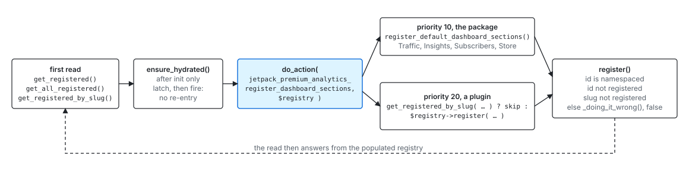

# Dashboard sections

How a section of the Premium Analytics dashboard is registered, filtered, served to the client, and rendered. A section is a top-level navigation item with a label, an order, a date-filter shape, an availability rule, and a default widget layout.

Sections are registered on the server by whoever owns them, the package for its own sections and another plugin for its section, through a single registry, and the client renders whatever the server publishes.

This page covers sections only. Widget types and report pages have their own registration paths, described at the end.

## Vocabulary

| Term           | Meaning                                                                                                                                               | Example                                    |
| -------------- | ----------------------------------------------------------------------------------------------------------------------------------------------------- | ------------------------------------------ |
| Dashboard name | The dashboard a section belongs to, as produced by the build pipeline. `DASHBOARD_NAME` in `src/dashboard-layout.php` names this package's dashboard. | `jetpack-premium-analytics_dashboard`      |
| Section id     | Namespaced identifier, `<namespace>/<slug>`. The namespace names the owner.                                                                           | `analytics/traffic`, `woocommerce/store`   |
| Slug           | The part after the namespace. Keys the section in `?section=`, the stored layouts and the client entity.                                              | `traffic`, `ads`                           |
| Label, title   | The navigation item text and the heading above the widgets. A null title falls back to the label.                                                     | `Ads`, `Site traffic`                      |
| Default layout | The widget instances a section shows until the reader customizes it.                                                                                  | see `get_traffic_section_default_layout()` |
| Preview scope  | The customer preview exposes only an allow-list of slugs; every other mode exposes every section the site qualifies for.                              | `PREVIEW_SECTIONS`                         |

## Files

| File                                               | Role                                                                                                                                                                      |
| -------------------------------------------------- | ------------------------------------------------------------------------------------------------------------------------------------------------------------------------- |
| `src/class-dashboard-section.php`                  | The section model: properties, `is_available()`, `get_default_layout()`, `to_array()`.                                                                                    |
| `src/class-dashboard-section-registry.php`         | The registry: `register()` with its validations, the reads, and the lazy hydration that fires the registration action.                                                    |
| `src/dashboard-sections.php`                       | The section API: the `register_dashboard_section()` family, the preview scope, the script data, the REST routes and their schema.                                         |
| `src/dashboard-layout.php`                         | Layout primitives: `DASHBOARD_NAME`, the default-layout filter name, `get_dashboard_default_widget_instance()`, and the package's availability policy on default layouts. |
| `src/default-dashboard-sections.php`               | The package's own sections: Traffic, Insights, Subscribers, Store, Ads, their gates and their default layouts, registered through the action like any plugin's.           |
| `src/class-analytics.php`                          | Loads the three files above on wp-admin requests (`load_dashboard_components()`).                                                                                         |
| `src/class-dashboard-support-routes.php`           | Loads them on REST requests (`boot_routes()`), on connected sites and, called directly by WordPress.com, on Simple.                                                       |
| `packages/data/src/entities/dashboard-entities.ts` | The `dashboardSection` core-data entity the client reads.                                                                                                                 |
| `routes/dashboard/`                                | `useDashboardSections()`, `useActiveSection()`, `useDashboardSectionLayout()`, and the stage that renders the navigation.                                                 |
| `routes/site-readiness.ts`                         | `isDashboardSectionInPreviewScope()`, the report routes' gate, fed by the inline script data.                                                                             |

## When the section files load


The same three files load on three paths, at three moments. In wp-admin `Analytics::load_dashboard_components()` requires them at plugin load, before `init`.

On a connected site's REST request, `Dashboard_Support_Routes::boot_routes()` requires them on `rest_api_init`, after `init`.

On WordPress.com Simple, the public-api process calls `Dashboard_Support_Routes::register()` directly, and the same `boot_routes()` runs.

Each include is guarded by a symbol the file declares, because two copies of the package can be loaded in one request on Simple.

That is why the registration moment is not `init`: a registrant hooked on `init` reaches the navigation in wp-admin and misses the REST response the navigation is built from. The registry hydrates on its first read, whichever path reads it, and fires one action then.

A read before `init` is a `_doing_it_wrong()`: it answers only what was registered directly, and does not latch, so the registrants hooked later still run on the first read after `init`.

## Registering a section



The package's own sections are registered by `register_default_dashboard_sections()` in `src/default-dashboard-sections.php`, from a callback on the action at priority 10, into the registry the action hands over, each skipped when its `id` is already registered.

A plugin registers a section from a callback on `jetpack_premium_analytics_register_dashboard_sections`:

```php
use Automattic\Jetpack\PremiumAnalytics\Capabilities;
use const Automattic\Jetpack\PremiumAnalytics\DASHBOARD_NAME;
use function Automattic\Jetpack\PremiumAnalytics\get_dashboard_default_widget_instance;

add_action(
	'jetpack_premium_analytics_register_dashboard_sections',
	static function ( $registry ) {
		$registry->register(
			DASHBOARD_NAME,
			'videopress/videos',
			array(
				'label'          => __( 'Videos', 'jetpack-videopress-pkg' ),
				'order'          => 45,
				'is_available'   => array( Capabilities::class, 'current_user_can_view_analytics' ),
				'default_layout' => static function () {
					return array(
						get_dashboard_default_widget_instance( 'videopress-top-videos', 'jpa/videopress', 0, 3, 2 ),
					);
				},
			)
		);
	},
	20
);
```

The mechanics behind it:

- **The contract.** The action hands over the `Dashboard_Section_Registry` being hydrated, and `$registry->register()` is what a plugin calls. `register_dashboard_section()` and the other functions in the `Automattic\Jetpack\PremiumAnalytics` namespace are the package's own helpers over the main instance, which is that same registry in production.
- **Loading.** The files are required by hand on the paths above, not autoloaded. The action fires from the registry those files load, so a callback on it runs only once the API is there and needs no `function_exists()` guard.
- **Validation in `register()`.** The dashboard name must match `get_dashboard_name_pattern()`, the id must be namespaced (`get_dashboard_section_id_pattern()`), and the id must not be registered. Each failure is a `_doing_it_wrong()` and a `false` return.
- **Slugs.** Two ids sharing a slug are not refused, and the client keys sections by slug, so a registrant must pick one no other section uses.
- **Arguments.** `label`, `title`, `order`, `date_filter` (`range` or `year`), `date_filter_options` (`with_date_comparison`, `with_header_date_control`), `requires_sync`, `is_available` (a boolean or a callable receiving the section, `true` by default), and `default_layout` (an array of instances or a callable returning one). Unknown keys are ignored, and an unrecognized `date_filter` keeps the default. See `Dashboard_Section::set_props()`.
- **Hydration.** `Dashboard_Section_Registry` fires the action from `ensure_hydrated()`, which `get_registered()` and `get_all_registered()` call on their first read after `init`. The latch is set before the action fires, so a callback that reads the registry does not re-enter it. `is_registered()` does not hydrate: `register()` relies on it, and a registrant may run before the action.
- **Order.** The package's own sections register at priority 10; a plugin that wants to see them registered first hooks later.

## From the registry to the client


On the server, `get_available_dashboard_sections()` keeps the sections whose `is_available()` is true and sorts them by `order`, then by id. `Dashboard_Section::is_available()` asks the preview scope first and the section's own rule second.

`to_array()` serializes `id`, `slug`, `label`, `title`, `order`, `date_filter`, `date_filter_options`, `requires_sync`, and the resolved `default_layout`.

The route `GET /wpcom/v2/dashboards/{name}/sections` returns that array, and `GET …/sections/{section}/default-layout` returns one section's layout. Both are gated on `Capabilities::current_user_can_view_analytics()`, and `get_dashboard_section_schema()` documents the shape.

The `wpcom/v2` namespace is what lets WordPress.com expose the route through public-api for Simple sites without a second registration.

On the client, the boot init module registers the `dashboardSection` core-data entity (`key: slug`, `baseURL` pointing at that route). `useDashboardSections()` reads it with `per_page: -1` and reports `hasResolved`.

The dashboard stage shows a spinner until then, because `WidgetDashboard` treats an empty layout as "no widgets" and opens edit mode.

The stage then builds the navigation from `{ slug, label }`, resolves the active section from `?section=` through `useActiveSection()`, and hands each section's `default_layout` to `useDashboardSectionLayout()`. An unknown slug falls back to the first section and rewrites the URL.

A second, smaller channel carries only the slugs. `inject_dashboard_preview_scope_script_data()` puts `premium_analytics.preview_sections` in `JetpackScriptData`, which `jetpack-assets` prints inline on the page.

`isDashboardSectionInPreviewScope()` reads it, and `getReportDefinition()` treats a report behind a hidden section as unknown, so the report and detail routes can redirect in `beforeLoad`, before any request.

This channel exists because the report registry lives in the client today. Once reports register on the server, it goes away.

## Default layouts


A section owns its default layout. The registration passes the instances, built with `get_dashboard_default_widget_instance( $uuid, $type, $order, $width, $height, $attributes )`, as an array or as a callable returning one.

`Dashboard_Section::get_default_layout()` runs the declared array through `jetpack_premium_analytics_dashboard_default_layout` with the section id and the section, and returns whatever comes back as a list.

Two kinds of callbacks hook that filter. A plugin adds an instance to a section it does not own, switching on `$section_id`:

```php
add_filter(
	'jetpack_premium_analytics_dashboard_default_layout',
	static function ( $layout, $section_id ) {
		if ( 'analytics/traffic' === $section_id ) {
			$layout[] = get_dashboard_default_widget_instance( 'videopress-top-videos', 'jpa/videopress', 8, 1, 2 );
		}

		return $layout;
	},
	10,
	2
);
```

The package removes the instances the site cannot serve at priority 100, `remove_unsupported_default_layout_items()` over `get_widget_support_context()`. A persisted layout keeps such an instance as a removable ghost widget, but a default must not seed one. Running late means an instance a plugin added gets the same treatment as a bundled one.

The client stores customized layouts in the `dashboardSectionLayouts` preference, keyed by slug. `useDashboardSectionLayout()` renders the stored layout when there is one and the section's `default_layout` otherwise.

Reset deletes the stored entry rather than copying the default into it, so a section that was reset follows later changes to the default.

A section that declares no layout opens in customize mode on the empty state, since `WidgetDashboard` treats an empty layout as "no widgets". A section meant to be read declares one.

## Availability and the preview

`is_available()` combines two rules, in this order:

1. **Preview scope**, which is about the rollout rather than the site.
2. **The section's own rule**, `is_available` from the registration.

**Preview scope.** `is_dashboard_preview_scoped()` is true when the site's own `jetpack_premium_analytics_enabled` option switched the dashboard on, the customer preview. In that mode, a section is exposed only when its slug is in `PREVIEW_SECTIONS` (`traffic` and `insights`).

`jetpack_premium_analytics_dashboard_preview_scope` then overrides the answer per section, and `__return_true` gives a development site every section. A dashboard other than this package's is never scoped.

The sticker and filter overrides that switch the dashboard on for the team leave the option off, so they see every section.

**The section's own rule** is a capability check, a plugin's presence, or a plan feature. Store checks WooCommerce and `manage_options` or `view_woocommerce_reports`. Subscribers checks the subscriptions module. Ads checks the WordAds module, or the plan feature on the WordPress.com platform, and `manage_options`.

A section that declares no rule is visible to anyone with analytics access, the gate of the sections route. A plugin registering one for a narrower audience passes its own `is_available`.

Each of the three has a filter of its own (`jetpack_premium_analytics_<name>_dashboard_section_available`).

A section that fails either rule is absent from the sections route, from the script data, and from the navigation, and `GET …/sections/{section}/default-layout` answers 404 for it.

## Where the tests are

| Behaviour                                                                                                         | Test                                                                 |
| ----------------------------------------------------------------------------------------------------------------- | -------------------------------------------------------------------- |
| Registry rules, hydration and the action, the built-in sections, preview scope, the sections route and its schema | `tests/php/Dashboard_Section_Test.php`                               |
| Default-layout primitives, the filter and the package's policy, the bundled layouts                               | `tests/php/Dashboard_Layout_Test.php`                                |
| The REST entry point WordPress.com calls                                                                          | `tests/php/Dashboard_Support_Routes_Test.php`                        |
| Navigation, active section, stored layouts, section heading                                                       | `routes/dashboard/**/*.test.ts(x)`                                   |
| Reports behind a hidden section                                                                                   | `routes/reports/registry.test.ts`, `tests/js/site-readiness.test.ts` |

## Not covered here

Widget types are registered from the build manifest through `Widget_Type_Registry` (`src/widget-types.php`). A public registration for other plugins is the next step.

Report pages are a client-side map in `routes/reports/registry.ts`, to be registered on the server the way sections are.

The stack that introduces the section contract, and the plan for those two, is recorded in Automattic/jetpack#52448.
