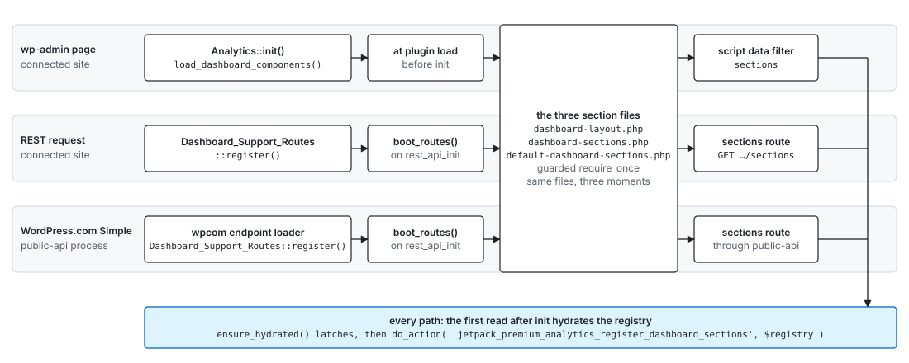

# Dashboard sections

How a section of the Premium Analytics dashboard is registered, filtered, served to the client, and rendered. A section is a top-level navigation item with a label, an order, a date-filter shape, an availability rule, and a default widget layout.

Sections are registered on the server by whoever owns them, the package for its own sections and another plugin for its section, through a single registry, and the client renders whatever the server publishes.

The package owns the dashboard, not the features: a section belongs to the code that knows its feature is there. Traffic and Insights are the package's own, since the dashboard is the Stats feature. A section that depends on another feature being present registers from that feature's code, in the plugin, the module or, on the WordPress.com platform, in `jetpack-mu-wpcom`.

This page covers sections only. Widget types have their own page, [Dashboard widget types](dashboard-widgets.md); report pages are described at the end.

## Vocabulary

| Term           | Meaning                                                                                                                                               | Example                                    |
| -------------- | ----------------------------------------------------------------------------------------------------------------------------------------------------- | ------------------------------------------ |
| Dashboard name | The dashboard a section belongs to, as produced by the build pipeline. `DASHBOARD_NAME` in `src/dashboard-layout.php` names this package's dashboard. | `jetpack-premium-analytics_dashboard`      |
| Section id     | Namespaced identifier, `<namespace>/<slug>`. The namespace names the owner.                                                                           | `analytics/traffic`, `wordads/ads`         |
| Slug           | The part after the namespace. Keys the section in `?section=`, the stored layouts and the client entity. Unique per dashboard.                        | `traffic`, `ads`                           |
| Label, title   | The navigation item text and the heading above the widgets. A null title falls back to the label.                                                     | `Ads`, `Site traffic`                      |
| Default layout | The widget instances a section shows until the reader customizes it.                                                                                  | see `get_traffic_section_default_layout()` |

## Files

| File                                               | Role                                                                                                                                                                      |
| -------------------------------------------------- | ------------------------------------------------------------------------------------------------------------------------------------------------------------------------- |
| `src/class-dashboard-section.php`                  | The section model: properties, `is_available()`, `get_default_layout()`, `to_array()`.                                                                                    |
| `src/class-dashboard-section-registry.php`         | The registry: `register()` with its validations, the reads, and the lazy hydration that fires the registration action.                                                    |
| `src/dashboard-sections.php`                       | The section API: the `register_dashboard_section()` family, the section script data, the REST routes and their schema.                                                    |
| `src/dashboard-layout.php`                         | Layout primitives: `DASHBOARD_NAME`, the default-layout filter name, `get_dashboard_default_widget_instance()`, and the package's availability policy on default layouts. |
| `src/default-dashboard-sections.php`               | The package's own sections: Traffic, Insights, Subscribers, their gates and their default layouts, registered through the action like any plugin's. The WooCommerce tab registers from the WooCommerce stats package. |
| `src/class-analytics.php`                          | Loads the three files above on wp-admin requests (`load_dashboard_components()`).                                                                                         |
| `src/class-dashboard-support-routes.php`           | Loads them on REST requests (`boot_routes()`), on connected sites and, called directly by WordPress.com, on Simple.                                                       |
| `packages/data/src/entities/dashboard-entities.ts` | The `dashboardSection` core-data entity the client reads.                                                                                                                 |
| `routes/dashboard/`                                | `useDashboardSections()`, `useActiveSection()`, `useDashboardSectionLayout()`, and the stage that renders the navigation.                                                 |
| `routes/site-readiness.ts`                         | `isDashboardSectionAvailable()`, the report routes' gate, fed by the inline script data.                                                                                  |

## When the section files load



The same three files load on three paths, at three moments. In wp-admin `Analytics::load_dashboard_components()` requires them at plugin load, before `init`.

On a connected site's REST request, `Dashboard_Support_Routes::boot_routes()` requires them on `rest_api_init`, after `init`.

On WordPress.com Simple, the public-api process calls `Dashboard_Support_Routes::register()` directly, and the same `boot_routes()` runs.

Each include is guarded by a symbol the file declares, because two copies of the package can be loaded in one request on Simple.

That is why the registration moment is not `init`: a registrant hooked on `init` reaches the navigation in wp-admin and misses the REST response the navigation is built from. The registry hydrates on its first read, whichever path reads it, and fires one action then.

A read before `init` is a `_doing_it_wrong()`: it answers only what was registered directly, and does not latch, so the registrants hooked later still run on the first read after `init`.

## Registering a section


The package's own sections are registered by `register_default_dashboard_sections()` in `src/default-dashboard-sections.php`, from a callback on the action at priority 10, into the registry the action hands over, each skipped when its `id` is already registered.

A plugin registers a section from a callback on `jetpack_premium_analytics_register_dashboard_sections`:

```php
use Automattic\Jetpack\PremiumAnalytics\Stats_Access;
use const Automattic\Jetpack\PremiumAnalytics\DASHBOARD_NAME;
use function Automattic\Jetpack\PremiumAnalytics\get_dashboard_default_widget_instance;
use function Automattic\Jetpack\PremiumAnalytics\register_dashboard_section;

add_action(
	'jetpack_premium_analytics_register_dashboard_sections',
	static function ( $registry ) {
		// Slugs key the URL and the stored layouts, so another owner of the same section wins.
		if ( $registry->get_registered_by_slug( DASHBOARD_NAME, 'videos' ) ) {
			return;
		}

		register_dashboard_section(
			DASHBOARD_NAME,
			'videopress/videos',
			array(
				'label'          => __( 'Videos', 'jetpack-videopress-pkg' ),
				'order'          => 45,
				'is_available'   => array( Stats_Access::class, 'current_user_can_view' ),
				'default_layout' => static function () {
					return array(
						get_dashboard_default_widget_instance( 'videopress-top-videos', 'videopress/top-videos', 0, 3, 2 ),
					);
				},
			)
		);
	},
	20
);
```

The mechanics behind it:

- **The contract.** A plugin calls `register_dashboard_section()` from its callback, the way `wp_register_ability()` is called on `wp_abilities_api_init`. The callback also receives the `Dashboard_Section_Registry` being hydrated, for lookups such as `get_registered_by_slug()`; the package's own registrant writes to it directly, the way `wp_default_scripts` callbacks write to `$scripts`. Both forms reach the same registry in production.
- **Loading.** The files are required by hand on the paths above, not autoloaded. The action fires from the registry those files load, so a callback on it runs only once the API is there and needs no `function_exists()` guard.
- **Validation in `register()`.** The dashboard name must match `get_dashboard_name_pattern()`, the id must be namespaced (`get_dashboard_section_id_pattern()`), the id must not be registered, and the slug must not be used by another id on the same dashboard. Each failure is a `_doing_it_wrong()` and a `false` return.
- **Slugs.** Two ids may not share a slug on one dashboard: the client keys sections, `?section=` and stored layouts by slug, so `register()` refuses the second. A registrant that may run beside another owner of the same section, the way Ads has one owner per environment plus an older package during a deploy skew, checks `get_registered_by_slug()` first.
- **Arguments.** `label`, `title`, `order`, `date_filter` (`range` or `year`), `date_filter_options` (`with_date_comparison`, `with_header_date_control`, `with_header_interval_control`), `requires_sync`, `is_available` (a boolean or a callable receiving the section, `true` by default), and `default_layout` (an array of instances or a callable returning one). Unknown keys are ignored, and an unrecognized `date_filter` keeps the default. See `Dashboard_Section::set_props()`.
- **Hydration.** `Dashboard_Section_Registry` fires the action from `ensure_hydrated()`, which `get_registered()`, `get_registered_by_slug()` and `get_all_registered()` call on their first read after `init`. The latch is set before the action fires, so a callback that reads the registry does not re-enter it. `is_registered()` does not hydrate: `register()` relies on it, and a registrant may run before the action.
- **Order.** The package's own sections register at priority 10; a plugin that wants to see them registered first, or that checks a slug before registering, hooks later, at priority 20.

## From the registry to the client


On the server, `get_available_dashboard_sections()` keeps the sections whose `is_available()` is true and sorts them by `order`, then by id. `Dashboard_Section::is_available()` answers with the section's own rule.

`to_array()` serializes `id`, `slug`, `label`, `title`, `order`, `date_filter`, `date_filter_options`, `requires_sync`, and the resolved `default_layout`.

The route `GET /wpcom/v2/dashboards/{name}/sections` returns that array, and `GET …/sections/{section}/default-layout` returns one section's layout. Both are gated on `Capabilities::current_user_can_view_analytics()`, and `get_dashboard_section_schema()` documents the shape.

The `wpcom/v2` namespace is what lets WordPress.com expose the route through public-api for Simple sites without a second registration.

On the client, the boot init module registers the `dashboardSection` core-data entity (`key: slug`, `baseURL` pointing at that route). `useDashboardSections()` reads it with `per_page: -1` and reports `hasResolved`.

The dashboard stage shows a spinner until then, because `WidgetDashboard` treats an empty layout as "no widgets" and opens edit mode.

The stage then builds the navigation from `{ slug, label }`, resolves the active section from `?section=` through `useActiveSection()`, and hands each section's `default_layout` to `useDashboardSectionLayout()`. An unknown slug falls back to the first section and rewrites the URL.

A second, smaller channel carries only the slugs. `inject_dashboard_sections_script_data()` puts `premium_analytics.sections` in `JetpackScriptData`, which `jetpack-assets` prints inline on the page.

`isDashboardSectionAvailable()` reads it, and `getReportDefinition()` treats a report behind a hidden section as unknown, so the report and detail routes can redirect in `beforeLoad`, before any request.

This channel exists because the report registry lives in the client today. Once reports register on the server, it goes away.

## Default layouts


A section owns its default layout. The registration passes the instances, built with `get_dashboard_default_widget_instance( $uuid, $type, $order, $width, $height, $attributes )`, as an array or as a callable returning one.

`Dashboard_Section::get_default_layout()` runs the declared array through `jetpack_premium_analytics_dashboard_default_layout` with the section id and the section, and returns whatever comes back as a list.

Two kinds of callbacks hook that filter. A plugin adds an instance to a section it does not own, switching on `$section_id`. This is the shape of `Analytics_Dashboard::add_default_layout_instance()` in `projects/packages/videopress/src/class-analytics-dashboard.php`, which seeds Top videos into Traffic:

```php
add_filter(
	'jetpack_premium_analytics_dashboard_default_layout',
	static function ( $layout, $section_id ) {
		if ( 'analytics/traffic' !== $section_id || ! is_array( $layout ) ) {
			return $layout;
		}

		foreach ( $layout as $item ) {
			if ( 'default-videopress-widget-instance' === ( $item['uuid'] ?? null ) ) {
				return $layout;
			}
		}

		$layout[] = get_dashboard_default_widget_instance( 'default-videopress-widget-instance', 'videopress/top-videos', 8, 1, 2 );

		return $layout;
	},
	10,
	2
);
```

The callback leaves a layout alone that already holds the instance; the real one also matches the type, current or former, since the package seeded the same instance before the widget moved. It does not check `WIDGET_API_VERSION`: the sections REST route hydrates layouts before the widget contract loads, and the policy below drops the instance on a site where the type never registers.

The package removes the instances the site cannot serve at priority 100, `remove_unsupported_default_layout_items()` over `get_widget_support_context()`. A persisted layout keeps such an instance as a removable ghost widget, but a default must not seed one. Running late means an instance a plugin added gets the same treatment as a bundled one.

The same callback drops an instance whose type the widget type registry has not registered, once the registry can answer: after `init`, with the widget type API loaded and at least one type registered. Before that, or on a checkout without a build, the default stays as declared. Just ahead of it, at priority 99, `resolve_former_widget_types_in_default_layout()` renames an instance added under a former name of a registered type (see [Renaming a widget type](dashboard-widgets.md#renaming-a-widget-type)).

The client stores customized layouts in the `dashboardSectionLayouts` preference, keyed by slug. `useDashboardSectionLayout()` renders the stored layout when there is one and the section's `default_layout` otherwise.

Reset deletes the stored entry rather than copying the default into it, so a section that was reset follows later changes to the default.

A section that declares no layout opens in customize mode on the empty state, since `WidgetDashboard` treats an empty layout as "no widgets". A section meant to be read declares one.

## Availability

`is_available()` is the section's own rule, `is_available` from the registration. The dashboard has no fixed list of tabs: every registered section the site qualifies for is shown.

The rule is a capability check, a plugin's presence, a plan feature, or a feature flag. WooCommerce checks that WooCommerce is active and, when the site's own `jetpack_premium_analytics_enabled` option switched the dashboard on, the `premium-analytics-store-section` flag; the blog sticker and filter overrides leave the option off and skip the flag. It also checks `manage_options` or `view_woocommerce_reports`. Subscribers checks the subscriptions module. Traffic and Insights declare no rule, so they take the default below, and every one of the package's own `analytics/…` sections also requires `Stats_Access::current_user_can_view()`, whatever its rule says. Ads checks `Capabilities::current_user_can_view_ad_reports()` from the registrant that decided WordAds is there.

A section that declares no rule is visible to readers who can view Stats (`Stats_Access::current_user_can_view()`). The dashboard itself, its menu and the sections route, opens for anyone with at least one available section, so a section's rule is also who it lets in: a shop manager reaches the dashboard through the WooCommerce tab alone.

WooCommerce and Subscribers each have a filter of their own (`jetpack_premium_analytics_<name>_dashboard_section_available`).

A section that fails its rule is absent from the sections route, from the script data, and from the navigation, and `GET …/sections/{section}/default-layout` answers 404 for it.

## A real consumer: the Ads section


### Who owns the section

The section, its layout and its widgets live in the `jetpack-ads` package (`projects/packages/ads`, `Analytics_Dashboard`). The package decides nothing about who gets Ads; whoever calls it hooks the action at priority 20.

### On self-hosted sites

WordAds is a module of the Jetpack plugin, so the module calls `Analytics_Dashboard::init()` from `modules/wordads/php/class-wordads-premium-analytics.php`. `class-wordads.php` loads it only while the module is active on a connected site.

### On WordPress.com

The module registrant skips the platform, `Host::is_wpcom_platform()`. `jetpack-mu-wpcom` calls the package's registrants instead when the plan includes WordAds and the site has it on, from `src/features/premium-analytics/wordads-section.php`: the WordAds module on Atomic, the approval stickers on Simple, as classic Stats reads them. A plan that could use WordAds is not a site that does.

Simple runs no Jetpack plugin, so that one file decides for both environments. One owner per environment, decided in code rather than by hook order.

The Jetpack plugin bundles the package, and `jetpack-mu-wpcom` lists it as a test-only dependency. WordPress.com loads the Jetpack copy, so Simple and Atomic serve the widget bundles from it, the way they serve this package.

### Deploy skew

Both registrants skip when a section with slug `ads` already exists. That matters during a deploy skew only: an older package that still registers the section itself keeps it.

They read the slug through `get_registered_by_slug()` when the package offers it and through `get_all_registered()` otherwise, since the package and the registrants ship on different cadences.

### The layout

Both register the same layout, `Analytics_Dashboard::get_default_layout()`, of the `wordads/*` widget types the same class registers (see [Dashboard widget types](dashboard-widgets.md#two-real-consumers)). The standalone `premium-analytics` plugin has no registrant, and no Ads section.

## A second consumer: a widget inside a bundled section

The VideoPress package owns no section. It owns one widget type, `videopress/top-videos`, and a place for it in the Traffic default layout, through the filter above. Who calls its registrants follows the Ads shape: `Initializer::active_initialization()` where VideoPress is active outside the WordPress.com platform, `jetpack-mu-wpcom` on Simple and Atomic where the plan includes VideoPress (`src/features/premium-analytics/videopress-widgets.php`).

The seed runs at priority 10 and asks nothing about the contract version. Whether the instance survives is decided here: the rename at 99 maps a former name, the policy at 100 drops a type that never registered. A consumer that seeds a bundled section's default therefore needs no guard of its own, only an idempotent callback.

The widget it seeds is the registrant's story, in [Dashboard widget types](dashboard-widgets.md#two-real-consumers).

## Where the tests are

| Behaviour                                                                                                           | Test                                                                                                                                                                                                                                                                     |
| ------------------------------------------------------------------------------------------------------------------- | ------------------------------------------------------------------------------------------------------------------------------------------------------------------------------------------------------------------------------------------------------------------------ |
| Registry rules, hydration and the action, the built-in sections, the sections route and its schema                  | `tests/php/Dashboard_Section_Test.php`                                                                                                                                                                                                                                   |
| Default-layout primitives, the filter and the package's policy, the bundled layouts                                 | `tests/php/Dashboard_Layout_Test.php`                                                                                                                                                                                                                                    |
| The WordAds module's registrant                                                                                     | `projects/plugins/jetpack/tests/php/modules/wordads/WordAds_Premium_Analytics_Test.php`                                                                                                                                                                                  |
| The Ads package's registrants, with and without the widget contract loaded                                          | `projects/packages/ads/tests/php/Analytics_Dashboard_Test.php`, `projects/packages/ads/tests/php/Analytics_Dashboard_Without_Widget_Types_Test.php`                                                                                                                      |
| The WordPress.com registrant                                                                                        | `projects/packages/jetpack-mu-wpcom/tests/php/features/premium-analytics/Wordads_Section_Test.php`                                                                                                                                                                       |
| The VideoPress package's layout seed, with and without the widget contract loaded, and its WordPress.com registrant | `projects/packages/videopress/tests/php/Analytics_Dashboard_Test.php`, `projects/packages/videopress/tests/php/Analytics_Dashboard_Without_Widget_Types_Test.php`, `projects/packages/jetpack-mu-wpcom/tests/php/features/premium-analytics/Videopress_Widgets_Test.php` |
| The REST entry point WordPress.com calls                                                                            | `tests/php/Dashboard_Support_Routes_Test.php`                                                                                                                                                                                                                            |
| Navigation, active section, stored layouts, section heading                                                         | `routes/dashboard/**/*.test.ts(x)`                                                                                                                                                                                                                                       |
| Reports behind a hidden section                                                                                     | `routes/reports/registry.test.ts`, `tests/js/site-readiness.test.ts`                                                                                                                                                                                                     |

## Not covered here

Widget types are registered through `Widget_Type_Registry` the same way, from `jetpack_premium_analytics_register_widget_types`: see [Dashboard widget types](dashboard-widgets.md).

Report pages are a client-side map in `routes/reports/registry.ts`, to be registered on the server the way sections are.

The stack that introduces the section contract, and the plan for those two, is recorded in Automattic/jetpack#52448.
