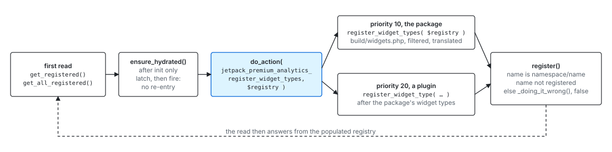

# Dashboard widget types

How a widget type of the Premium Analytics dashboard is registered, filtered, served to the client, and imported. A widget type is a namespaced name plus the script modules and the metadata the client needs to offer it in the picker and render it in a section's layout.

Widget types are registered on the server by whoever owns them, the package for the widgets in its build and another plugin for its own, through a single registry, and the client offers whatever the server publishes.

This page covers the registration path. Sections, which place widget instances in default layouts, have their own page, [Dashboard sections](dashboard-sections.md).

## Vocabulary

| Term                         | Meaning                                                                                                                                                                  | Example                                                       |
| ---------------------------- | ------------------------------------------------------------------------------------------------------------------------------------------------------------------------ | ------------------------------------------------------------- |
| Widget type name             | Namespaced identifier, `<namespace>/<name>`, lowercase. The namespace names the owner.                                                                                   | `jpa/wordads-highlights`                                      |
| Render module, widget module | The script-module ids of the widget's render entry and metadata entry, which the client `import()`s through the page import map.                                         | `jetpack-premium-analytics/widgets/wordads-highlights/render` |
| Manifest                     | The widgets wp-build discovered under `widgets/`, generated into `build/widgets.php` and read through `jpa_get_registered_widget_modules()`.                             | see `Analytics::widget_manifest_path()`                       |
| Candidate                    | A manifest entry before the registry-time filter. A dropped candidate never registers.                                                                                   | `jetpack_premium_analytics_registrable_widget_types`          |
| Metadata                     | `presentation`, `category`, `title`, `description`, `help`, `icon`, `actions`, `keywords`: what the picker shows, translated and sanitized on the way into the registry. | see `Widget_Type`                                             |

## Files

| File                                 | Role                                                                                                                                                                                                                                               |
| ------------------------------------ | -------------------------------------------------------------------------------------------------------------------------------------------------------------------------------------------------------------------------------------------------- |
| `src/class-widget-type.php`          | The widget type model: the name, the two module ids, the metadata fields, `is_renderable()`.                                                                                                                                                       |
| `src/class-widget-type-registry.php` | The registry: `register()` with its validations, the reads, and the lazy hydration that fires the registration action.                                                                                                                             |
| `src/widget-types.php`               | The widget type API: `register_widget_types_from_manifest()`, `register_widget_type()`, `WIDGET_API_VERSION`, the package's own registrant, the metadata translation and sanitizers, the two availability filters, `get_available_widget_types()`. |
| `src/widget-availability.php`        | The package's policy on manifest candidates: environment, plugins present, capabilities.                                                                                                                                                           |
| `src/widget-type-support.php`        | The package's policy on default layouts: which types a site cannot serve.                                                                                                                                                                          |
| `src/widget-modules.php`             | The two readers: `ensure_widget_registry_ready()`, the `/wpcom/v2/widget-modules` route, and the import-map entries on the page boot dependencies.                                                                                                 |
| `build/widgets.php`                  | Generated by wp-build: the manifest, and `jpa_register_widget_modules()`, which registers the package's script modules.                                                                                                                            |
| `routes/use-widget-modules.ts`       | The client's read of the records, as a core-data entity.                                                                                                                                                                                           |
| `routes/widget-module-i18n.ts`       | The client resolver: loads a widget bundle's translation catalog, then imports the module.                                                                                                                                                         |

## When the widget type files load

`ensure_widget_registry_ready()` runs ahead of the two reads, and only then: on Simple the REST registration runs on every public-api request, and most never read the registry. It requires `widget-types.php` and `widget-availability.php`, then the manifest, so that when the registry hydrates, the package's registrant finds `jpa_get_registered_widget_modules()` and the registry-time filter is hooked.

The two reads are `get_widget_modules_response()`, the REST route the client fetches, and `add_widget_modules_to_boot_deps()`, the callback on `jetpack-premium-analytics-wp-admin_boot_dependencies` that puts each module id in the page import map. Both happen after `init`. On WordPress.com Simple the route runs from public-api, through `Dashboard_Support_Routes::register()`.

That is why the registration moment is not `init`: the registry hydrates on its first read, whichever reader gets there first, and fires one action then.

A read before `init` is a `_doing_it_wrong()`: it answers only what was registered directly, and does not latch, so the registrants hooked later still run on the first read after `init`.

## Registering a widget type



The package's own widget types are registered by `register_widget_types()` in `src/widget-types.php`, from a callback on the action at priority 10, into the registry the action hands over. Each manifest candidate that survives `jetpack_premium_analytics_registrable_widget_types` is translated by `translate_widget_metadata()`, sanitized (`help`, `icon`, `actions`) and registered, skipped when its name is already registered.

A plugin with a `widgets/` folder of its own, built with wp-build, registers the whole manifest its build generates from a callback on `jetpack_premium_analytics_register_widget_types`:

```php
use const Automattic\Jetpack\PremiumAnalytics\WIDGET_API_VERSION;
use function Automattic\Jetpack\PremiumAnalytics\register_widget_types_from_manifest;

require_once __DIR__ . '/build/build.php';

add_action(
	'jetpack_premium_analytics_register_widget_types',
	static function () {
		if ( version_compare( WIDGET_API_VERSION, '2', '>=' ) ) {
			return;
		}

		register_widget_types_from_manifest(
			jetpack_videopress_get_registered_widget_modules(),
			array( 'textdomain' => 'jetpack-videopress-pkg' )
		);
	},
	20
);
```

The `require_once` of the generated `build/build.php` is what registers the plugin's widget script modules: the generated `build/widgets.php` hooks that on `init` by itself. `jetpack_videopress_get_registered_widget_modules()` is the manifest accessor wp-build generates from `wpPlugin.name`; guard it with `function_exists()` where the build can be absent.

A single type written by hand goes through `register_widget_type( $name, $args )`, the primitive the helper is built on.

The mechanics behind it:

- **The contract.** The action hands over the `Widget_Type_Registry` being hydrated. `register_widget_types_from_manifest()` and `register_widget_type()` are what a plugin calls; both write to the main instance, which is that same registry in production. `$registry` is there for lookups, `is_registered()` and `get_all_registered()`. The package's own registrant writes into `$registry` directly, so a test can hydrate a fresh instance.
- **Manifests.** The helper runs the candidates through `jetpack_premium_analytics_registrable_widget_types`, gives each one without a `textdomain` the one passed in `$args`, translates the metadata with `translate_widget_metadata()`, sanitizes `help`, `icon` and `actions`, and skips a name already registered. The package's own `register_widget_types()` is its first caller.
- **Loading.** The files are required by `ensure_widget_registry_ready()`, not autoloaded. The action fires from the registry those files load, so a callback on it runs only once the API is there and needs no `function_exists()` guard.
- **Validation in `register()`.** The name must be a lowercase `<namespace>/<name>` string, and must not be registered. Each failure is a `_doing_it_wrong()` and a `false` return.
- **Arguments.** Any public property of `Widget_Type`: `render_module`, `widget_module`, `presentation` (`framed`, `content-bleed` or `full-bleed`), `category`, `title`, `description`, `help` (`content` plus optional `links`), `icon` (`collection/name`), `actions`, `keywords`. `set_props()` copies every key onto the instance. Through `register_widget_type()` the strings arrive translated and `help`, `icon` and `actions` in shape; the manifest helper translates and sanitizes them itself.
- **Version.** `WIDGET_API_VERSION` names the contract a widget is built against (see below). A consumer compares it in the callback and skips registration when the major differs.
- **Script modules.** The module ids are what the client hands to `import()`. The package's are registered by the generated `jpa_register_widget_modules()`; a plugin's by the same generated file of its own build, required at plugin load, from a build that keeps `@jetpack-premium-analytics/widgets-toolkit` and `@jetpack-premium-analytics/data` external (`wpPlugin.externalNamespaces`), so they resolve through the page import map.
- **Hydration.** `Widget_Type_Registry` fires the action from `ensure_hydrated()`, which `get_registered()` and `get_all_registered()` call on their first read after `init`. The latch is set before the action fires, so a callback that reads the registry does not re-enter it. `is_registered()` does not hydrate: `register()` relies on it, and a registrant may run before the action.
- **Order.** The package's own widget types register at priority 10; a plugin that wants to see them registered first hooks later.
- **Translations on the client.** `routes/widget-module-i18n.ts` loads a translation catalog before importing a module only for the package's own bundles, the ids under `jetpack-premium-analytics/widgets/`. A plugin's module imports through the bare `import()` fallback, and its strings render in English on a localized site until the records carry a text domain and a manifest of their own.

## From the registry to the client

On the server, `get_available_widget_types()` runs the registered map through `jetpack_premium_analytics_widget_types`, the runtime filter, and both readers use it, so the REST list and the import map share one policy.

`GET /wpcom/v2/widget-modules` returns one record per available type: `name`, `render_module`, `widget_module` and the metadata fields. It is gated on `Capabilities::current_user_can_view_analytics()`, the dashboard's own gate, and the `wpcom/v2` namespace is what lets WordPress.com expose it through public-api for Simple sites.

`add_widget_modules_to_boot_deps()` adds each `render_module` and `widget_module` as a dynamic dependency of the page, which the generated page loader turns into import-map entries. A type whose module id no script module claims imports nothing, and an instance of it renders as "Widget is no longer available".

On the client, `useWidgetModules()` reads the records as a core-data entity, `useWidgetTypesWithI18n()` resolves the ones the active layout renders, and the widget dashboard offers the types in the picker and imports an instance's render module through `resolveWidgetModuleWithI18n()` when it renders.

## Availability

Two filters, both problem-agnostic:

1. **Registry-time**, `jetpack_premium_analytics_registrable_widget_types`, over the manifest candidates in `register_widget_types()`. A dropped candidate never registers: gone from the REST list, the import map and every registry reader. For hard availability.
2. **Runtime**, `jetpack_premium_analytics_widget_types`, over the registered map on every read of `get_available_widget_types()`. The type stays registered. For request-dependent or soft state, e.g. a type shown locked.

The package's own policy hooks the first, in `src/widget-availability.php`: developer-only widgets off production, the store and bookings categories without WooCommerce or Bookings, the store report categories without the capability. A plugin's manifest goes through the same filter when it registers through `register_widget_types_from_manifest()`; a type registered one by one with `register_widget_type()` does not. Either way, a plugin decides in its callback whether to register at all, as the section owners do.

A third policy, in `src/widget-type-support.php`, acts on default layouts rather than on the registry: `remove_unsupported_default_layout_items()` drops from a section's default the instances whose type the site cannot serve. It reads a fixed list, not the registry (see [Default layouts](dashboard-sections.md#default-layouts)).

## Versioning the contract

`WIDGET_API_VERSION` names the contract a widget is built against: the shared module ids (`@jetpack-premium-analytics/widgets-toolkit`, `@jetpack-premium-analytics/data`, `@jetpack-premium-analytics/externals`), the `Widget_Type` fields the client reads, and the toolkit exports a widget relies on. The major changes when a widget built against the previous contract stops working; the minor when a consumer can rely on something new.

Inside `plugins/jetpack` the package and a consumer module ship together, so the check is a formality. With the standalone `plugins/premium-analytics` next to another plugin, each brings its own copy, and the check is what keeps a widget built against 1.x from registering on a 2.x package.

## Where the tests are

| Behaviour                                                                                                                                                | Test                                                                |
| -------------------------------------------------------------------------------------------------------------------------------------------------------- | ------------------------------------------------------------------- |
| Hydration and the action, `register_widget_type()`, `register_widget_types_from_manifest()`, `WIDGET_API_VERSION`, a plugin's type reaching both readers | `tests/php/Widget_Type_Registry_Test.php`                           |
| Metadata translation and sanitizing, the REST record                                                                                                     | `tests/php/Widget_Metadata_Test.php`                                |
| The route's namespace and gate, hydration from the route                                                                                                 | `tests/php/Widget_Modules_Test.php`, `tests/php/Analytics_Test.php` |
| The package's candidate policy and the runtime filter                                                                                                    | `tests/php/Widget_Availability_Test.php`                            |
| The client's records read                                                                                                                                | `routes/use-widget-modules.test.ts`                                 |

## Not covered here

Translation catalogs for a module built by another plugin, and the first plugin-owned widgets, the Ads widgets from the WordAds module, are the next steps of this stack.
