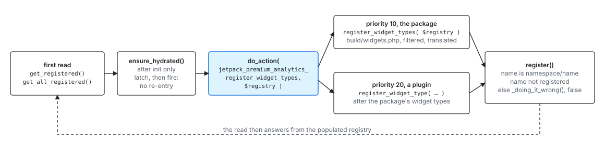

# Dashboard widget types

How a widget type of the Premium Analytics dashboard is registered, filtered, served to the client, and imported. A widget type is a namespaced name plus the script modules and the metadata the client needs to offer it in the picker and render it in a section's layout.

Widget types are registered on the server by whoever owns them: the package for the widgets in its build, another plugin for its own. One registry holds them all, and the client offers whatever the server publishes.

This page covers the registration path. Sections, which place widget instances in default layouts, have their own page, [Dashboard sections](dashboard-sections.md).

## Vocabulary

| Term                         | Meaning                                                                                                                                                                  | Example                                              |
| ---------------------------- | ------------------------------------------------------------------------------------------------------------------------------------------------------------------------ | ---------------------------------------------------- |
| Widget type name             | Namespaced identifier, `<namespace>/<name>`, lowercase. The namespace names the owner.                                                                                   | `jpa/clicks`, `wordads/highlights`                   |
| Render module, widget module | The script-module ids of the widget's render entry and metadata entry, which the client `import()`s through the page import map.                                         | `jetpack-premium-analytics/widgets/clicks/render`    |
| Manifest                     | The widgets wp-build discovered under `widgets/`, generated into `build/widgets.php` and read through `jpa_get_registered_widget_modules()`.                             | see `Analytics::widget_manifest_path()`              |
| Candidate                    | A manifest entry before the registry-time filter. A dropped candidate never registers.                                                                                   | `jetpack_premium_analytics_registrable_widget_types` |
| Metadata                     | `presentation`, `category`, `title`, `description`, `help`, `icon`, `actions`, `keywords`: what the picker shows, translated and sanitized on the way into the registry. | see `Widget_Type`                                    |
| Catalog location             | `textdomain` and `i18n_manifest`: the text domain the widget's bundles are stamped with, and the i18n manifest of the build that serves them.                            | see `Widget_Type`                                    |
| SDK                          | `@automattic/jetpack-premium-analytics-sdk`: the one name a plugin's widgets import the dashboard through.                                                               | `projects/js-packages/premium-analytics-sdk`         |

## Files

| File                                 | Role                                                                                                                                                                                                                                               |
| ------------------------------------ | -------------------------------------------------------------------------------------------------------------------------------------------------------------------------------------------------------------------------------------------------- |
| `src/class-widget-type.php`          | The widget type model: the name, the two module ids, the metadata fields, the catalog location, `is_renderable()`.                                                                                                                                 |
| `src/class-widget-type-registry.php` | The registry: `register()` with its validations, the reads, and the lazy hydration that fires the registration action.                                                                                                                             |
| `src/widget-types.php`               | The widget type API: `register_widget_types_from_manifest()`, `register_widget_type()`, `WIDGET_API_VERSION`, the package's own registrant, the metadata translation and sanitizers, the two availability filters, `get_available_widget_types()`. |
| `src/widget-availability.php`        | The package's policy on manifest candidates: environment, plugins present, capabilities.                                                                                                                                                           |
| `src/widget-type-support.php`        | The package's policy on default layouts: which types a site cannot serve.                                                                                                                                                                          |
| `src/widget-modules.php`             | The two readers: `ensure_widget_registry_ready()`, the `/wpcom/v2/widget-modules` route, and the import-map entries on the page boot dependencies.                                                                                                 |
| `src/sdk-module.php`                 | Registers the facade module built from `packages/sdk` a second time, as `@automattic/jetpack-premium-analytics-sdk`.                                                                                                                               |
| `packages/sdk/`                      | The SDK facade: re-exports of the toolkit, data, fields, dates and shared primitives a widget imports, built as the `@jetpack-premium-analytics/sdk` module.                                                                                       |
| `build/widgets.php`                  | Generated by wp-build: the manifest, and `jpa_register_widget_modules()`, which registers the package's script modules.                                                                                                                            |
| `routes/use-widget-modules.ts`       | The client's read of the records, as a core-data entity.                                                                                                                                                                                           |
| `routes/widget-module-i18n.ts`       | The client resolver: loads a widget bundle's translation catalog from the domain and manifest its record declares, then imports the module.                                                                                                        |

## When the widget type files load

`ensure_widget_registry_ready()` runs ahead of the two reads, and only then. On Simple the REST registration runs on every public-api request, and most never read the registry.

It requires `widget-types.php` and `widget-availability.php`, then the manifest. When the registry hydrates, the package's registrant finds `jpa_get_registered_widget_modules()` and the registry-time filter is hooked.

The two reads are `get_widget_modules_response()`, the REST route the client fetches, and `add_widget_modules_to_boot_deps()`, the callback on `jetpack-premium-analytics-wp-admin_boot_dependencies` that puts each module id in the page import map. Both happen after `init`. On WordPress.com Simple the route runs from public-api, through `Dashboard_Support_Routes::register()`.

That is why the registration moment is not `init`: the registry hydrates on its first read, whichever reader gets there first, and fires one action then.

A read before `init` is a `_doing_it_wrong()`. It answers only what was registered directly and does not latch, so the registrants hooked later still run on the first read after `init`.

## Registering a widget type



### The package's own widgets

`register_widget_types()` in `src/widget-types.php` registers them from a callback on the action at priority 10, into the registry the action hands over.

Each manifest candidate that survives `jetpack_premium_analytics_registrable_widget_types` is translated by `translate_widget_metadata()`, sanitized (`help`, `icon`, `actions`) and registered. A name already registered is skipped.

### A plugin's widgets

A plugin with a `widgets/` folder of its own, built with wp-build, registers the whole manifest its build generates from a callback on `jetpack_premium_analytics_register_widget_types`. This is the shape of the VideoPress registrant, `Analytics_Dashboard::register_widget_types()` in `projects/packages/videopress/src/class-analytics-dashboard.php`:

```php
use function Automattic\Jetpack\PremiumAnalytics\register_widget_types_from_manifest;

add_action(
	'jetpack_premium_analytics_register_widget_types',
	static function ( $registry ) {
		if ( ! defined( 'Automattic\\Jetpack\\PremiumAnalytics\\WIDGET_API_VERSION' ) ) {
			return;
		}
		$version = \Automattic\Jetpack\PremiumAnalytics\WIDGET_API_VERSION;
		if ( version_compare( $version, '1.3.0', '<' ) || version_compare( $version, '2', '>=' ) ) {
			return;
		}

		require_once __DIR__ . '/build/build.php';

		register_widget_types_from_manifest(
			jetpack_videopress_get_registered_widget_modules(),
			array(
				'textdomain'    => 'jetpack-videopress-pkg',
				'i18n_manifest' => plugins_url( 'i18n-manifest.json', __DIR__ . '/build/build.php' ),
				'former_names'  => array( 'videopress/top-videos' => array( 'jpa/videopress' ) ),
			),
			$registry
		);
	},
	20
);
```

The version range is the consumer's own: the lowest contract its widgets import from, below the next major. An undefined version is a request that never loaded `widget-types.php`, such as the sections REST route, and the registrant waits for one that does.

The `require_once` of the generated `build/build.php` is what registers the plugin's widget script modules. The generated `build/widgets.php` hooks that on `init` by itself, or runs at once when `init` has fired, so a plugin that pays the registration only on sites that qualify requires it from inside the callback.

`jetpack_videopress_get_registered_widget_modules()` is the manifest accessor wp-build generates from `wpPlugin.name`. Guard it with `function_exists()` where the build can be absent, and hand the helper an empty manifest then: it registers nothing, and a test can still feed candidates through `jetpack_premium_analytics_registrable_widget_types`. A plugin needs no manifest hook of its own.

`i18n_manifest` is the URL of the build's `i18n-manifest.json`, which `stamp-textdomains` writes next to the bundles. The real code appends the package version to it as a cache buster.

`former_names` maps a current name to the names it registered under before (see [Renaming a widget type](#renaming-a-widget-type)).

A single type written by hand goes through `register_widget_type( $name, $args )`, the primitive the helper is built on.

### The contract

The action hands over the `Widget_Type_Registry` being hydrated. `register_widget_types_from_manifest()` and `register_widget_type()` are what a plugin calls. The helper takes `$registry` as its third argument and defaults to the main instance, which is that same registry in production; `register_widget_type()` always writes to the main instance.

`$registry` also serves lookups, `is_registered()` and `get_all_registered()`. The package's own registrant and the Ads one pass it through the helper, so a test can hydrate a fresh instance.

### What the manifest helper does

It runs the candidates through `jetpack_premium_analytics_registrable_widget_types`, gives each one without a `textdomain` or an `i18n_manifest` the ones passed in `$args`, translates the metadata with `translate_widget_metadata()`, sanitizes `help`, `icon` and `actions`, and skips a name already registered.

The package's own `register_widget_types()` is its first caller, with its text domain and no manifest: the page's boot init module loads the package's catalogs.

### Loading

The files are required by `ensure_widget_registry_ready()`, not autoloaded. The action fires from the registry those files load, so a callback on it runs only once the API is there and needs no `function_exists()` guard.

### Validation in `register()`

The name must be a lowercase `<namespace>/<name>` string, and must not be registered. Each failure is a `_doing_it_wrong()` and a `false` return.

### Arguments

Any public property of `Widget_Type`: `render_module`, `widget_module`, `presentation` (`framed`, `content-bleed` or `full-bleed`), `category`, `title`, `description`, `help` (`content` plus optional `links`), `icon` (`collection/name`), `actions`, `keywords`, `textdomain`, `i18n_manifest`, `former_names`, `chart_interval` (`control` or `none`). `set_props()` copies every key onto the instance.

Through `register_widget_type()` the strings arrive translated and `help`, `icon` and `actions` in shape. The manifest helper translates and sanitizes them itself.

### Version

`WIDGET_API_VERSION` names the contract a widget is built against (see [Versioning the contract](#versioning-the-contract)). A consumer compares it in the callback: it skips registration when the major differs, and waits while the minor is below the one its imports need.

### Hydration and order

`Widget_Type_Registry` fires the action from `ensure_hydrated()`, which `get_registered()` and `get_all_registered()` call on their first read after `init`. The latch is set before the action fires, so a callback that reads the registry does not re-enter it.

`is_registered()` does not hydrate: `register()` relies on it, and a registrant may run before the action.

The package's own widget types register at priority 10. A plugin that wants to see them registered first hooks later.

### Renaming a widget type

A type that changes its name declares the old one in `former_names`: in `widget.json`, in the `$args['former_names']` map of `register_widget_types_from_manifest()` (current name to former names), or in the arguments of `register_widget_type()`. Moving a widget to its owner's package is such a rename, `jpa/x` to `owner/x`. Declaring former names needs `WIDGET_API_VERSION` 1.1.0.

The registry maps each former name to the current one. `get_registered()` answers for both, `resolve_name()` gives the current name, and `register()` refuses a former name a registered type or another type's former name holds, and a name that is someone's former name.

The REST record publishes `former_names`. The dashboard stage maps a stored layout's types through them before rendering (`buildWidgetTypeRenames()`, `useDashboardSectionLayout()`), with no write-back: the current name persists with the section's next commit. On the server, `resolve_former_widget_types_in_default_layout()` renames default-layout instances at priority 99, ahead of the unregistered-type check, so a plugin that still adds an instance under the old name keeps it.

A rename keeps the attributes as they are. One that changes them needs a migration, which nothing offers yet.

### Script modules

The module ids are what the client hands to `import()`. The package's are registered by the generated `jpa_register_widget_modules()`; a plugin's by the same generated file of its own build.

### The SDK a plugin imports

A plugin's widgets import the dashboard through `@automattic/jetpack-premium-analytics-sdk` (`projects/js-packages/premium-analytics-sdk`), a types-only package that declares itself a script module (`wpScriptModuleExports`).

wp-build finds it installed under that name, leaves the import external (`wpPlugin.externalNamespaces` lists the `automattic` scope) and records it as a module dependency of the widget.

`src/sdk-module.php` registers the facade built from `packages/sdk` under that same name on `wp_default_scripts`. The page import map resolves the SDK to the facade and the facade to the dashboard's own modules: one React, one toolkit, one query client for the dashboard and every widget on the page.

### Translations on the client

Every record says where its bundles' catalogs live. `routes/widget-module-i18n.ts` derives the bundle path from the module id, `{handle-prefix}/widgets/{dir}/{render,widget}` to `build/widgets/{dir}/{render,widget}.js`, whatever the prefix.

`createWidgetModuleResolver()` caches the record's manifest by URL once (`loadI18nManifest()` in wp-build-polyfills) and loads the bundle's catalog under the record's `textdomain` before importing. The metadata bundles are preloaded the same way. A record without a text domain is treated as the package's own.

What the catalog load hashes is the bundle path relative to the plugin, the way WordPress names JS translation files. A package vendored inside a plugin therefore needs its text domain aliased in the plugin's `i18n-map.php`, as this package's is.

## From the registry to the client

### One policy for both readers

On the server, `get_available_widget_types()` runs the registered map through `jetpack_premium_analytics_widget_types`, the runtime filter. Both readers use it, so the REST list and the import map share one policy.

### The REST record

`GET /wpcom/v2/widget-modules` returns one record per available type: `name`, `render_module`, `widget_module`, the metadata fields, `textdomain`, `i18n_manifest` and `former_names`.

It is gated on `Capabilities::current_user_can_view_analytics()`, the dashboard's own gate. The `wpcom/v2` namespace is what lets WordPress.com expose it through public-api for Simple sites.

### The import map

`add_widget_modules_to_boot_deps()` adds each `render_module` and `widget_module` as a dynamic dependency of the page, which the generated page loader turns into import-map entries.

A type whose module id no script module claims imports nothing, and an instance of it renders as "Widget is no longer available".

### The client

`useWidgetModules()` reads the records as a core-data entity, and `useWidgetTypesWithI18n()` resolves the ones the active layout renders.

The widget dashboard offers the types in the picker and imports an instance's render module through the resolver `useWidgetModuleResolver()` builds from the records.

### The chart interval control

`chart_interval` says how a widget uses the page's chart interval: `control` draws it and carries the control through `chartIntervalAttributeField()`, `none` never reads it. wp-build does not carry the key from `widget.json`, so a build declares it in the `$args['chart_interval']` map of `register_widget_types_from_manifest()`, as `WIDGET_CHART_INTERVALS` does for the package's own widgets. Declaring it needs `WIDGET_API_VERSION` 1.4.0. An undeclared widget is treated as one that may read the interval.

## Availability

Two filters, both problem-agnostic, plus a policy on default layouts.

### Registry-time filter

`jetpack_premium_analytics_registrable_widget_types` runs over the manifest candidates in `register_widget_types()`. A dropped candidate never registers: gone from the REST list, the import map and every registry reader. For hard availability.

The package's own policy hooks it, in `src/widget-availability.php`: developer-only widgets off production, the store and bookings categories without WooCommerce or Bookings, the store report categories without the capability.

A plugin's manifest goes through the same filter when it registers through `register_widget_types_from_manifest()`. A type registered one by one with `register_widget_type()` does not. Either way, a plugin decides in its callback whether to register at all, as the section owners do.

### Runtime filter

`jetpack_premium_analytics_widget_types` runs over the registered map on every read of `get_available_widget_types()`. The type stays registered. For request-dependent or soft state, e.g. a type shown locked.

### Default layouts

A third policy acts on default layouts rather than on the registry: `remove_unsupported_default_layout_items()` in `src/dashboard-layout.php`, over the type lists of `src/widget-type-support.php`, drops from a section's default the instances whose type the site cannot serve.

It reads the package's fixed list and, once the registry can answer, the registry itself: an instance whose type is not registered is dropped too (see [Default layouts](dashboard-sections.md#default-layouts)).

## Versioning the contract

`WIDGET_API_VERSION` names the contract a widget is built against: the `@automattic/jetpack-premium-analytics-sdk` module and the exports it declares, the dashboard modules the facade re-exports from (`@jetpack-premium-analytics/widgets-toolkit`, `data`, `fields`, `datetime`, `externals`), and the `Widget_Type` fields the client reads.

The major changes when a widget built against the previous contract stops working; the minor when a consumer can rely on something new. So far, 1.1.0 added `former_names` and 1.2.0 `Leaderboard`, `describeError()` and `useStatsVideoPlays`, 1.3.0 `ExporterCsvDownloadButton`, which takes the linked report by id, and 1.4.0 `chart_interval`.

Inside `plugins/jetpack` the package and a consumer module ship together, so the check is a formality. With the standalone `plugins/premium-analytics` next to another plugin, each brings its own copy, and the check is what keeps a widget built against 1.x from registering on a 2.x package.

## Two real consumers

The Ads package owns a section of its own with three widgets. The VideoPress package owns one widget inside a section this package bundles. Between them they answer most of the questions a third consumer will have.

### Where the widgets live

The three Ads widgets live in `projects/packages/ads`, a widgets-only wp-build project. `wpPlugin.name` is `jetpack_ads` and the handle prefix `jetpack-ads`, so the module ids are `jetpack-ads/widgets/<dir>/render` and `…/widget`.

The Top videos widget lives in `projects/packages/videopress/widgets/top-videos/`, next to the routes that package already built with wp-build. The same `wpPlugin.name`, `jetpack_videopress`, gives the module ids `jetpack-videopress/widgets/top-videos/render` and `…/widget`. A package that already builds with wp-build adds a `widgets/` folder and nothing else to its build.

Neither package points at this one with a `../` path or a workspace alias. Ads requires this package with Composer, since it registers against its API. VideoPress lists it as a `require-dev` only: the registration action fires when the dashboard is loaded and never otherwise, and two core packages depend on VideoPress.

### One import: the SDK

The widgets import the dashboard by one name, `@automattic/jetpack-premium-analytics-sdk`. Each package depends on it with `workspace:*` and lists the `automattic` scope in `wpPlugin.externalNamespaces`.

wp-build keeps a specifier external only when it finds that package installed under the specifier and declaring `wpScriptModuleExports`. The SDK package does, so the import stays external, the way `@wordpress/*` does.

The SDK package (`projects/js-packages/premium-analytics-sdk`) holds the contract only, the types of what a widget can import. This package provides the implementation: `packages/sdk`, a facade over the toolkit, data, fields, dates and shared primitives, built as `@jetpack-premium-analytics/sdk` and registered a second time under the SDK's name by `src/sdk-module.php`. A widget therefore runs on the module instances the dashboard renders with.

The SDK exposes widget kinds and host capabilities, never the parts a kind is built from, and no dashboard policy value. Top videos renders one component, `Leaderboard`, hands it rows and a request status, and reads its data through `useStatsVideoPlays`, a provisional entry that leaves the SDK when the package owns its data. How many rows it asks for is its own constant; how many the dashboard shows is `Leaderboard`'s.

### What each package registers

`Analytics_Dashboard::init()` hooks the registrants at priority 20 in both packages.

Ads: `register_section()` registers `wordads/ads` with its layout of `wordads/chart-tabs`, `wordads/highlights` and `wordads/earnings-history`. It skips when the `ads` slug is taken, or when `WIDGET_API_VERSION` moved to a major the package was not built against. An undefined version is not a mismatch: the sections REST route hydrates the section registry before the dashboard loads `widget-types.php`. `register_widget_types()` waits for that version, requires the generated `build/build.php` from inside the callback, and hands the manifest to `register_widget_types_from_manifest()` with the text domain `jetpack-ads-pkg` and the URL of its `i18n-manifest.json`.

VideoPress: `register_widget_types()` registers `videopress/top-videos` the same way, with `jpa/videopress` as its former name, and waits for 1.3.0, the contract the widget imports from. `add_default_layout_instance()` seeds the widget into the Traffic section's default layout at priority 10 on `jetpack_premium_analytics_dashboard_default_layout`, where this package used to seed it: order 8, one column by two rows, the same instance uuid. It leaves a layout alone that already holds the instance, by uuid or by type, current or former. It does not wait for the contract version: the dashboard's own policy drops the instance on a site where the type never registers (see [Default layouts](dashboard-sections.md#default-layouts)).

### Who calls it

Ads is the section's story, in [Dashboard sections](dashboard-sections.md#a-real-consumer-the-ads-section): the WordAds module outside the WordPress.com platform, `jetpack-mu-wpcom` on Simple and Atomic where the plan includes WordAds and the site has it on.

VideoPress follows `Status::is_active()`: `Initializer::active_initialization()` calls `init()` where the VideoPress module of the Jetpack plugin or the standalone plugin is active, and `init()` returns early on the WordPress.com platform. `jetpack-mu-wpcom` calls the two registrants from `src/features/premium-analytics/videopress-widgets.php` on Simple and Atomic where `wpcom_site_has_feature( 'videopress' )` holds. Both run against the copy the Jetpack plugin bundles, so Simple, which runs no Jetpack module, serves the bundles from it too.

### Layouts saved before the move

The Ads types were `jpa/wordads-*` while they lived here, and the package declares no former names: a layout persisted with those names renders its tiles as unavailable until it is reset.

Top videos moved with `jpa/videopress` declared as a former name. A stored layout that still carries it renders Top videos, and a default layout seeded under the old name is renamed on the server before the unregistered-type check runs.

### What leaves this package

The widget folder, its default instance in Traffic, its entry in `VIDEOPRESS_WIDGET_TYPES`, and the row helpers only it used. `src/videopress-availability.php` stays: the Videos report and the video detail route still gate on it, and whether the widget appears is the VideoPress package's call now.

## Where the tests are

| Behaviour                                                                                                                                                                                                           | Test                                                                                                                                                                                                                                                                                                         |
| ------------------------------------------------------------------------------------------------------------------------------------------------------------------------------------------------------------------- | ------------------------------------------------------------------------------------------------------------------------------------------------------------------------------------------------------------------------------------------------------------------------------------------------------------ |
| Hydration and the action, `register_widget_type()`, `register_widget_types_from_manifest()`, `WIDGET_API_VERSION`, a plugin's type reaching both readers                                                            | `tests/php/Widget_Type_Registry_Test.php`                                                                                                                                                                                                                                                                    |
| Metadata translation and sanitizing, the REST record                                                                                                                                                                | `tests/php/Widget_Metadata_Test.php`                                                                                                                                                                                                                                                                         |
| The route's namespace and gate, hydration from the route                                                                                                                                                            | `tests/php/Widget_Modules_Test.php`, `tests/php/Analytics_Test.php`                                                                                                                                                                                                                                          |
| The package's candidate policy and the runtime filter                                                                                                                                                               | `tests/php/Widget_Availability_Test.php`                                                                                                                                                                                                                                                                     |
| The client's records read                                                                                                                                                                                           | `routes/use-widget-modules.test.ts`                                                                                                                                                                                                                                                                          |
| The client's catalog loads per record, the resolver, the metadata preload                                                                                                                                           | `tests/js/widget-module-i18n.test.tsx`, `wp-build-polyfills/tests/js/load-i18n-catalogs.test.js`                                                                                                                                                                                                             |
| The SDK registration: the facade's id, bundle, dependencies and version                                                                                                                                             | `tests/php/Sdk_Module_Test.php`                                                                                                                                                                                                                                                                              |
| The Ads package's registrants, with and without the widget contract loaded, and the module and mu-wpcom callers                                                                                                     | `packages/ads/tests/php/Analytics_Dashboard_Test.php`, `packages/ads/tests/php/Analytics_Dashboard_Without_Widget_Types_Test.php`, `plugins/jetpack/tests/php/modules/wordads/WordAds_Premium_Analytics_Test.php`, `packages/jetpack-mu-wpcom/tests/php/features/premium-analytics/Wordads_Section_Test.php` |
| The VideoPress package's registrant and layout seed, with and without the widget contract loaded, and the mu-wpcom caller; the fixture manifest enters through `jetpack_premium_analytics_registrable_widget_types` | `packages/videopress/tests/php/Analytics_Dashboard_Test.php`, `packages/videopress/tests/php/Analytics_Dashboard_Without_Widget_Types_Test.php`, `packages/jetpack-mu-wpcom/tests/php/features/premium-analytics/Videopress_Widgets_Test.php`                                                                |
| A consumer widget's render, against a stand-in for the SDK module: the rows, the status, the error copy and the footer it hands the dashboard's components                                                          | `packages/videopress/widgets/top-videos/test/render.test.tsx`                                                                                                                                                                                                                                                |

## Not covered here

- Stories for a plugin's widgets, and a jest harness that renders the real SDK: the Ads and VideoPress widgets left this package's Storybook with their move. The SDK module has no implementation outside the dashboard, so a consumer's suite stands in for it and asserts on what the widget hands over, as the Top videos suite does.
- Precise types for the SDK: `projects/js-packages/premium-analytics-sdk` declares its exports loosely until a build step emits them from the facade.
- A migration for a rename that also changes attributes, the `deprecated` equivalent of blocks, and the upstream ask: `@wordpress/widget-primitives` knows neither former names nor deprecations.
- The metadata strings of `widget.json`, which reach no catalog in any package until the strings stub ships.
