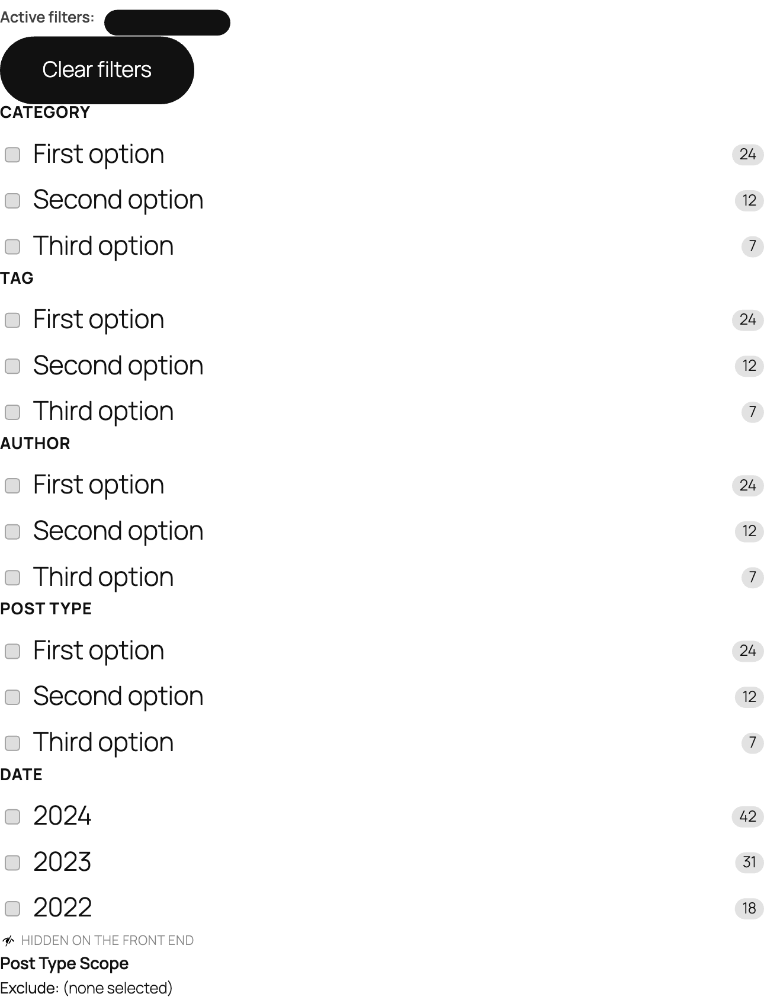

# Jetpack Search Blocks

Jetpack Search provides a set of blocks you can combine in the Site Editor or Page Editor to build a fully customisable search experience. All blocks update results instantly as visitors type or apply filters — no page reload required.

## Prerequisites

Before any of these blocks can return results, the Jetpack Search service has to be set up for the site:

1. Activate the **Jetpack** plugin and connect the site to a WordPress.com account.
2. From **Jetpack → Search**, enable Jetpack Search and let the initial content index complete.

The blocks themselves can be inserted before the index is ready, but the front end will show empty result lists until indexing finishes.

## Where to find the blocks

All Search blocks are grouped under a **Jetpack Search** category in the block inserter. Open the inserter (the **+** button in the editor toolbar), scroll to **Jetpack Search**, and the full set is listed there.

## How to build a search page

1. Create a new page (or open your search template in the Site Editor).
2. Add the **Search Input** block where you want the search box to appear.
3. Add the **Search Results** block below it — this automatically includes a results list, count, sort control, "load more" button, and attribution.
4. Optionally add a **Filters** block in a sidebar column to let visitors narrow results by category, tag, date, author, or post type.

## Search shell blocks

These blocks make up the search query input and results display area.

| Block | What it does |
|-------|-------------|
| [Search Input](./search-input/README.md) | The search box where visitors type their query. |
| [Search Results](./search-results/README.md) | Container for the results area — comes pre-built with count, sort, list, load-more, and attribution. |
| [Results List](./results-list/README.md) | Displays the actual search results. Choose between compact, expanded, or product layouts. |
| [Results Count](./results-count/README.md) | Shows how many results were found (e.g. "1,234 results for 'wordpress'"). |
| [Sort By](./results-sort/README.md) | Lets visitors change the order of results (newest, oldest, relevance, etc.). |
| [Load More](./results-load-more/README.md) | A button that loads the next page of results without a page reload. |
| [Powered by Jetpack](./powered-by/README.md) | Attribution link — required on the free Jetpack Search plan. |

## Filtering blocks

These blocks let visitors (or site editors) narrow search results.

### Containers

| Block | What it does |
|-------|-------------|
| [Filters](./filters/README.md) | A vertical sidebar-style panel that holds filter blocks. |
| [Collapsible Filters](./filters-popover/README.md) | A compact button that opens a filter panel — good for search bars in headers or tight layouts. |

### Filter controls

These go inside a Filters or Collapsible Filters container.

| Block | What it does |
|-------|-------------|
| [Active Filters](./active-filters/README.md) | Shows the currently applied filters as dismissible pills. |
| [Clear Filters](./clear-filters/README.md) | A button that removes all active filters at once. |
| [Filter by Date](./filter-date/README.md) | Lets visitors narrow results to a specific year or month. |
| [Post Type Scope](./filter-post-type/README.md) | Silently limits search results to specific post types — no visible UI for visitors. |

### Checkbox filter family

The Checkbox Filter ships as a family of named filters — each one shows up as its own card in the inserter, pre-configured for a specific dimension. Add as many as you need; visitors see one labelled list per filter.

| Block | What it does |
|-------|-------------|
| [Filter by Category](./filter-checkbox/README.md#filter-by-category) | Filter by built-in WordPress Category. |
| [Filter by Tag](./filter-checkbox/README.md#filter-by-tag) | Filter by built-in WordPress Tag. |
| [Filter by Post Type](./filter-checkbox/README.md#filter-by-post-type) | Visitor-facing post type picker (Post / Page / custom types). |
| [Filter by Author](./filter-checkbox/README.md#filter-by-author) | Filter by post author. |
| [Filter by Product Category](./filter-checkbox/README.md#filter-by-product-category) | WooCommerce product category. |
| [Filter by Product Tag](./filter-checkbox/README.md#filter-by-product-tag) | WooCommerce product tag. |
| [Filter by Product Brand](./filter-checkbox/README.md#filter-by-product-brand) | WooCommerce product brand (only when a `product_brand` taxonomy is registered). |
| [Filter by Custom Taxonomy](./filter-checkbox/README.md#filter-by-custom-taxonomy) | Any other registered taxonomy — pick the slug after inserting. |

## Choosing a filter layout

**Use Filters** when you have a sidebar layout and want filters always visible alongside results.

**Use Collapsible Filters** when you have a compact layout (e.g. a header search bar) and want filters available without permanently occupying space.

Both layouts support the same set of filter blocks inside them.

## Free plan vs paid plan

Jetpack Search has both free and paid tiers. Two things to know:

- **Free plan:** the **Powered by Jetpack** attribution is required and is automatically re-added if removed from a Search Results container.
- **Result limits and indexing speed** differ between tiers — the blocks themselves work the same, but the underlying search service may apply caps. See the [Jetpack Search documentation](https://jetpack.com/support/search/) for details.

## Theming and styling

All blocks expose the standard WordPress block style controls (color, typography, spacing, border) through the editor sidebar. Blocks that contain other blocks (`Search Results`, `Filters`, `Collapsible Filters`) style their wrapper and let each inner block be styled individually.

Frontend rendering is interactive (uses the WordPress Interactivity API) — clicks and keystrokes update the result list and active-filter pills without a page reload.

---

> WooCommerce-specific filter blocks (`filter-wc-attribute`, `filter-wc-price`, `filter-wc-rating`, `filter-wc-stock-status`, `filters-product`) are documented separately. The WooCommerce-flavoured Checkbox Filter variations (`Filter by Product Category`, `Filter by Product Tag`, `Filter by Product Brand`) live with the rest of the Checkbox Filter family above because they share the `jetpack-search/filter-checkbox` block type — they're variations of one block, not separate WC-only blocks.
