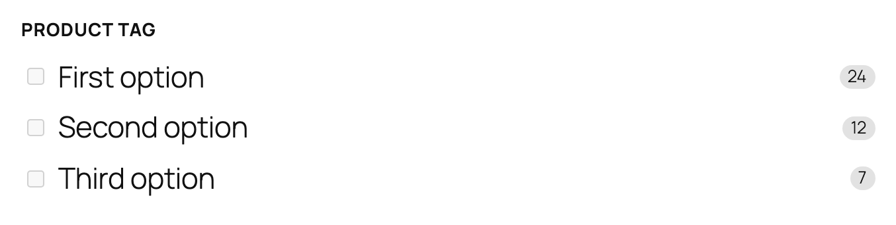
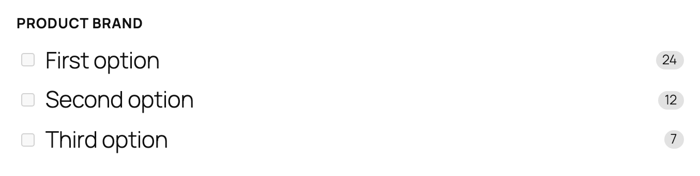

# WooCommerce features in Jetpack Search blocks

Jetpack Search blocks recognize when WooCommerce is active and grow extra options designed for shops — filters for product taxonomies, attributes, price, rating, and stock status; a result format that surfaces price and rating; and sort orders that match how shoppers actually browse. None of these surfaces appear (or run) on sites without WooCommerce, so they don't clutter the editor for non-shop authors.

This document is the index. Everything WooCommerce-specific lives in one of two places:

- **Blocks that only exist on WooCommerce sites** — each has its own README in its block folder.
- **Shared blocks that grow extra options on WooCommerce sites** — covered below, because the rest of the block's behavior is documented with the block itself.

## What gets added to the inserter

When WooCommerce is active, the block inserter exposes a cluster of product-specific blocks and variations:

Without WooCommerce, this whole product cluster disappears from the inserter — only the base **Checkbox Filter** stays, which authors can still configure to filter by Category, Tag, Author, or any registered taxonomy. Authors don't need to think about which block is "the WooCommerce one" — anything they see in the inserter is something they can use on their site.

## WooCommerce-only blocks

Each of these blocks has a dedicated README in its folder. Open them for setup, settings, and tips:

| Block                                                            | Slug                       | Use it for                                                     |
|------------------------------------------------------------------|----------------------------|----------------------------------------------------------------|
| [Filter by Product Attribute](./filter-wc-attribute/README.md)   | `filter-wc-attribute`      | Color, Size, Material, and any other attribute your store uses |
| [Filter by Price](./filter-wc-price/README.md)                   | `filter-wc-price`          | Min / Max inputs and / or a draggable range slider             |
| [Filter by Rating](./filter-wc-rating/README.md)                 | `filter-wc-rating`         | Star-rating threshold rows (★★★★ & up)                         |
| [Filter by Stock Status](./filter-wc-stock-status/README.md)     | `filter-wc-stock-status`   | An "In stock" toggle                                           |
| [Product Filters](./filters-product/README.md)                   | `filters-product`          | A ready-made shop sidebar wrapping the four filters above      |

## Shared blocks with WooCommerce features

These blocks ship on every site that uses Jetpack Search. They render perfectly well without WooCommerce, but expose extra options when it's active.

### Filter by Product Category

Lets shoppers narrow product results by WooCommerce product category. Categories typically form your store's primary department hierarchy ("Clothing → Tshirts", "Decor → Wall art") — this is the filter most shoppers reach for first.

**Editor preview:**

**When to use it:** any shop page that surfaces products from more than one department. It's the single most-clicked filter on most stores, so place it near the top of your filter sidebar.

**Settings:** opens the shared **Checkbox Filter** inspector (see [Shared settings inspector](#shared-settings-inspector) below). The defaults are sensible: **Label** is *Product Category*, **Display style** is *Checkbox list*, **Show result counts** is on.

**Tips:**

- Sort order **By count (most matches first)** keeps the most-stocked departments at the top, which usually matches what shoppers expect.
- For deep category hierarchies, leave **Display style** on **Checkbox list** — chips break visually when labels are long.
- Pair with [Filter by Price](./filter-wc-price/README.md), [Filter by Rating](./filter-wc-rating/README.md), and [Filter by Stock Status](./filter-wc-stock-status/README.md) inside a [Product Filters](./filters-product/README.md) container.

### Filter by Product Tag

Lets shoppers narrow product results by WooCommerce product tag. Tags are looser, faceted labels that cut across categories — typical examples are *Sale*, *New*, *Limited Edition*, or attribute-like tags ("Eco-friendly", "Gift").

**Editor preview:**

**When to use it:** when your store uses tags for shopper-meaningful labels and you want to expose them as a filter alongside the primary category browse. Skip it if your tags are mostly internal/SEO bookkeeping — they'll confuse rather than help.

**Settings:** opens the shared **Checkbox Filter** inspector (see [Shared settings inspector](#shared-settings-inspector) below). The defaults are sensible: **Label** is *Product Tag*, **Display style** is *Checkbox list*, **Show result counts** is on.

**Tips:**

- Tags often have short labels — switch **Display style** to **Chips** to read them as a tighter, tag-cloud-style row.
- Use sparingly. Two or three filters in the sidebar convert better than a stack of marginally useful ones; tags are a strong candidate for the cut if shoppers don't actually think in your tag taxonomy.
- Pair with [Filter by Price](./filter-wc-price/README.md), [Filter by Rating](./filter-wc-rating/README.md), and [Filter by Stock Status](./filter-wc-stock-status/README.md) inside a [Product Filters](./filters-product/README.md) container.

### Filter by Product Brand

Lets shoppers narrow product results by brand. Brand is its own WooCommerce taxonomy (built into recent WooCommerce versions, or registered by an extension like WC Brands or Perfect Brands).

**Editor preview:**

**When to use it:** when you carry multiple brands and your shoppers already know which ones they trust. Skip it for single-brand stores — the filter would always show just one option.

This block only appears in the inserter when WooCommerce **and** the Product Brand taxonomy are both available on your site. If you don't see it, open **WooCommerce → Products → Brands** in your admin and create one — once a brand exists, the filter becomes available.

**Settings:** opens the shared **Checkbox Filter** inspector (see [Shared settings inspector](#shared-settings-inspector) below). The defaults are sensible: **Label** is *Product Brand*, **Display style** is *Checkbox list*, **Show result counts** is on.

**Tips:**

- Brand names are usually short — switch **Display style** to **Chips** for a more compact, "tag cloud" feel.
- Place the brand filter below category filters in the sidebar, since most shoppers browse by department first and only filter by brand once the category is set.
- Pair with [Filter by Price](./filter-wc-price/README.md), [Filter by Rating](./filter-wc-rating/README.md), and [Filter by Stock Status](./filter-wc-stock-status/README.md) inside a [Product Filters](./filters-product/README.md) container.

### Shared settings inspector

The three Product Category / Tag / Brand variations are all configured through the **Checkbox Filter** block's inspector — same set of settings, same UI, just preset to a different **Filter type**:

| Setting | What it does |
|---------|--------------|
| **Filter type** | Which taxonomy this filter groups results by. Inherited from the variation you inserted — switch it to convert a Brand filter into a Tag filter without losing other settings. |
| **Label** | The heading shown above the options. Defaults to the variation's name (*Product Category*, *Product Tag*, *Product Brand*). |
| **Show result counts** | Shows the number of matching products next to each option (e.g. *Clothing (19)*). On by default. |
| **Display style** | **Checkbox list** for clarity and longer labels (default); **Chips** for compact, short-label sets. |
| **Maximum items** | How many options to show before collapsing the rest under a *Show more* link. Defaults to 10. |
| **Sort order** | **By count (most matches first)** by default, or **Alphabetical** when you need predictable A–Z. |
| **Logic** | **Any** (default) shows products matching at least one selection; **All** requires every selected option to match — useful for narrowing down with multiple tags. |

### Results List — Product layout

The **Results List** block has a **Result format** setting that decides how each result is rendered. On WooCommerce sites a third option appears:

The Product format is tuned for shop results. Each row gets:

- A product **image** on the left
- The product **title**
- **Price** — with the original price struck through next to the sale price when the item is on sale
- A **5-star rating** with the review count next to it
- A small **match hint** ("Matches content" / "Matches comments") so shoppers can see why a product surfaced when it wasn't a title match

**Editor preview:**

**Tips:**

- Pick **Product (for WooCommerce stores)** for any page that searches products — a search-results page, a category landing page, anywhere the result set is exclusively products. Pair it with the **Post Type Scope** child of [Product Filters](./filters-product/README.md) so non-product content doesn't sneak in.
- Leave the format on **Compact** or **Expanded** for any page that mixes products with posts and pages — the Product layout reads strangely when half the results don't have a price or rating.
- If you switch a saved page from a shop layout to a non-WooCommerce site (or deactivate WooCommerce), the format silently falls back to **Expanded** so the page still renders sensibly. You don't need to re-pick a format.

### Sort By — Price and Rating sort options

The **Sort By** block ships with three universal sort orders — Relevance, Newest, Oldest. On a WooCommerce site three product-specific orders join the menu:

- **Rating** (highest-rated first)
- **Price: low to high**
- **Price: high to low**

They appear in the **Available options** panel in the inspector, unchecked by default. Tick the ones you want exposed in the shopper-facing dropdown:

Whichever options you tick become selectable in the front-end sort menu, and any that you tick can also be set as the **Default sort** (the order applied on first load when the URL doesn't specify one).

**Tips:**

- Three is usually the right number of exposed sort options. Most stores work well with **Relevance**, **Price: low to high**, and **Price: high to low** — that covers "show me what matches" and "show me by budget" without overwhelming the dropdown.
- Add **Rating** if your store leans on customer reviews as a quality signal. Skip it if your catalog doesn't have meaningful rating data — an empty "Rating" sort just confuses shoppers.
- Avoid **Newest** / **Oldest** for shop pages unless your store thrives on fresh drops (fashion, fast-moving consumer goods) — date sorts feel out of place when the content is a stable catalog.
- The three product sort orders are also URL-aware: a shopper can land on `?orderby=price_asc` from a "Shop by price" link, and Search will honor it. On non-WooCommerce sites those URL parameters are quietly ignored and the page falls back to its default sort.

### Active Filters — Price-range chip

The **Active Filters** block shows a dismissable pill for every selection a visitor has made. On a WooCommerce site, the price range from **Filter by Price** appears as its own chip alongside the rest:

The chip's label adapts to which bounds the shopper has set:

| Selection | Chip label |
|-----------|------------|
| Both bounds | **Price: $10 – $50** |
| Min only | **Price: $10+** |
| Max only | **Price: Under $50** |

The currency symbol is pulled from the **Filter by Price** block's settings (which in turn defaults to whatever your store's WooCommerce currency setting is), so a £-denominated store gets **£10 – £50** automatically. Clicking the **×** clears the range — both bounds at once — without touching any other active filter.

**Tips:**

- Place **Active Filters** above the **Filter by Price** block (and the other filters) in your sidebar so shoppers can see and dismiss the current selection at a glance.
- The price chip uses the **same** dismiss control as every other filter chip, so visitors don't have to learn separate UI to clear a price range vs. a category selection.

## Putting it together: a shop search page

A complete WooCommerce shop search experience usually combines:

- A search input
- An **Active Filters** block (with the **Price-range chip** showing whenever a range is set)
- A **Product Filters** sidebar (Stock Status + Rating + Price + at least one Product Attribute or Product Category filter)
- A **Sort By** block with **Relevance** + the two **Price** orders enabled
- A **Results List** in **Product (for WooCommerce stores)** format

Each of those pieces is documented in its own README — open the links above for setup details and tips specific to that block.
