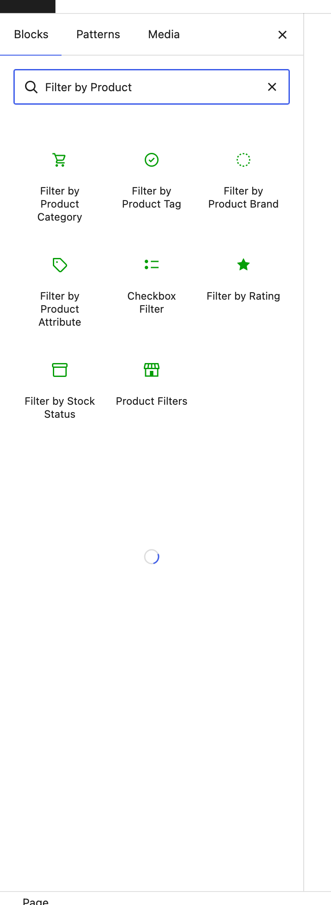
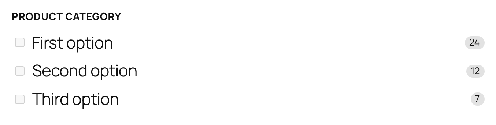
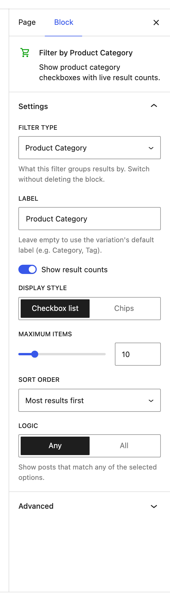
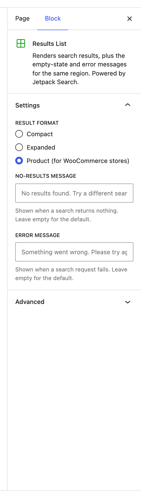
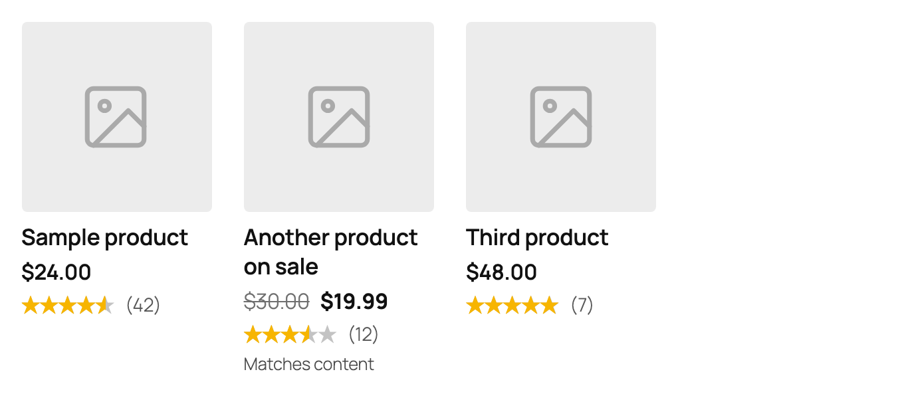
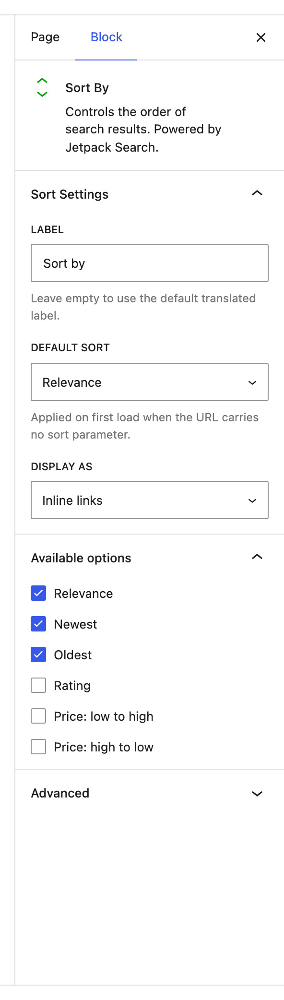

# WooCommerce features in Jetpack Search blocks

Jetpack Search blocks recognize when WooCommerce is active and grow extra options designed for shops — filters for product taxonomies, attributes, price, rating, and stock status; a result format that surfaces price and rating; and sort orders that match how shoppers actually browse. None of these surfaces appear (or run) on sites without WooCommerce, so they don't clutter the editor for non-shop authors.

This document is the index. Everything WooCommerce-specific lives in one of two places:

- **Blocks that only exist on WooCommerce sites** — each has its own README in its block folder.
- **Shared blocks that grow extra options on WooCommerce sites** — covered below, because the rest of the block's behavior is documented with the block itself.

## What gets added to the inserter

When WooCommerce is active, the block inserter exposes a cluster of product-specific blocks and variations:

The same cluster collapses to just **Checkbox Filter** and **Filter by Rating** (and a few other non-product blocks) when WooCommerce isn't active. Authors don't need to think about which one is "the WooCommerce one" — anything they see in the inserter is something they can use.

## WooCommerce-only blocks

Each of these blocks has a dedicated README in its folder. Open them for setup, settings, and tips:

| Block | Slug | Use it for |
|-------|------|-----------|
| [Filter by Product Attribute](./filter-wc-attribute/README.md) | `filter-wc-attribute` | Color, Size, Material, and any other attribute your store uses |
| [Filter by Price](./filter-wc-price/README.md) | `filter-wc-price` | Min / Max inputs and / or a draggable range slider |
| [Filter by Rating](./filter-wc-rating/README.md) | `filter-wc-rating` | Star-rating threshold rows (★★★★ & up) |
| [Filter by Stock Status](./filter-wc-stock-status/README.md) | `filter-wc-stock-status` | An "In stock" toggle |
| [Product Filters](./filters-product/README.md) | `filters-product` | A ready-made shop sidebar wrapping the four filters above |

## Shared blocks with WooCommerce features

These blocks ship on every site that uses Jetpack Search. They render perfectly well without WooCommerce, but expose extra options when it's active.

### Checkbox Filter — Product Category, Product Tag, Product Brand

The base **Checkbox Filter** block has a single setting — **Filter type** — that decides what dimension it groups results by. On a WooCommerce site, three product-specific values appear in that dropdown alongside Post Type, Category, Tag, Author, and Custom Taxonomy:

- **Product Category** (`product_cat`)
- **Product Tag** (`product_tag`)
- **Product Brand** (`product_brand`) — only shown when your store has the Product Brand taxonomy registered (built into recent WooCommerce, or installed via an extension like WC Brands or Perfect Brands)

Each one is also a separate card in the inserter, so authors who know they want to filter by category can pick **Filter by Product Category** directly.

**Editor preview:**

**Settings panel:**

The settings panel is shared with the rest of the Checkbox Filter variations — so everything you can tune for a Category filter (Display style, Maximum items, Sort order, Logic) applies to the product variations too. The differences are entirely in the data source:

| Setting | What changes for product variations |
|---------|--------------------------------------|
| **Filter type** | Set to **Product Category**, **Product Tag**, or **Product Brand**. Switching between any two doesn't lose your other settings. |
| **Label** | Defaults to *Product Category*, *Product Tag*, or *Product Brand*. Override with your store's voice (e.g. "Shop by Department"). |
| **Display style** | **Chips** reads beautifully for short brand names and tags. **Checkbox list** is the right default for longer category trees. |
| **Maximum items** | Same behavior — limits how many buckets are shown, with the remainder collapsed under a "Show more" link. |

**Tips:**

- Use **Filter by Product Category** in any shop sidebar where shoppers browse by department. It's the single most-clicked filter on most stores.
- Use **Filter by Product Tag** sparingly — tags work better as a discovery surface (related-products carousel, footer cloud) than as a primary filter, because shoppers don't usually think in tags.
- Use **Filter by Product Brand** when you sell multiple brands and your shoppers already know which ones they trust. Skip it for a single-brand store.
- All three pair naturally with **Filter by Price**, **Filter by Rating**, and **Filter by Stock Status** inside a [Product Filters](./filters-product/README.md) container.

### Results List — Product layout

The **Results List** block has a **Result format** setting that decides how each result is rendered. On WooCommerce sites a third option appears:

The Product format is tuned for shop results. Each row gets:

- A product **image** on the left
- The product **title**
- **Price** — with the original price struck through next to the sale price when the item is on sale
- A **5-star rating** with the review count next to it
- A small **match hint** ("Matches content" / "Matches comments") so shoppers can see why a product surfaced when it wasn't a title match

**Editor preview:**

**Tips:**

- Pick **Product (for WooCommerce stores)** for any page that searches products — a search-results page, a category landing page, anywhere the result set is exclusively products. Pair it with the **Post Type Scope** child of [Product Filters](./filters-product/README.md) so non-product content doesn't sneak in.
- Leave the format on **Compact** or **Expanded** for any page that mixes products with posts and pages — the Product layout reads strangely when half the results don't have a price or rating.
- If you switch a saved page from a shop layout to a non-WooCommerce site (or deactivate WooCommerce), the format silently falls back to **Expanded** so the page still renders sensibly. You don't need to re-pick a format.

### Sort By — Price and Rating sort options

The **Sort By** block ships with three universal sort orders — Relevance, Newest, Oldest. On a WooCommerce site three product-specific orders join the menu:

- **Rating** (highest-rated first)
- **Price: low to high**
- **Price: high to low**

They appear in the **Available options** panel in the inspector, unchecked by default. Tick the ones you want exposed in the shopper-facing dropdown:

Whichever options you tick become selectable in the front-end sort menu, and any that you tick can also be set as the **Default sort** (the order applied on first load when the URL doesn't specify one).

**Tips:**

- Three is usually the right number of exposed sort options. Most stores work well with **Relevance**, **Price: low to high**, and **Price: high to low** — that covers "show me what matches" and "show me by budget" without overwhelming the dropdown.
- Add **Rating** if your store leans on customer reviews as a quality signal. Skip it if your catalog doesn't have meaningful rating data — an empty "Rating" sort just confuses shoppers.
- Avoid **Newest** / **Oldest** for shop pages unless your store thrives on fresh drops (fashion, fast-moving consumer goods) — date sorts feel out of place when the content is a stable catalog.
- The three product sort orders are also URL-aware: a shopper can land on `?orderby=price_asc` from a "Shop by price" link, and Search will honor it. On non-WooCommerce sites those URL parameters are quietly ignored and the page falls back to its default sort.

### Active Filters — Price-range chip

The **Active Filters** block shows a dismissable pill for every selection a visitor has made. On a WooCommerce site, the price range from **Filter by Price** appears as its own chip alongside the rest:

The chip's label adapts to which bounds the shopper has set:

| Selection | Chip label |
|-----------|------------|
| Both bounds | **Price: $10 – $50** |
| Min only | **Price: $10+** |
| Max only | **Price: Under $50** |

The currency symbol is pulled from the **Filter by Price** block's settings (which in turn defaults to whatever your store's WooCommerce currency setting is), so a £-denominated store gets **£10 – £50** automatically. Clicking the **×** clears the range — both bounds at once — without touching any other active filter.

**Tips:**

- Place **Active Filters** above the **Filter by Price** block (and the other filters) in your sidebar so shoppers can see and dismiss the current selection at a glance.
- The price chip uses the **same** dismiss control as every other filter chip, so visitors don't have to learn separate UI to clear a price range vs. a category selection.

## Putting it together: a shop search page

A complete WooCommerce shop search experience usually combines:

- A search input
- An **Active Filters** block (with the **Price-range chip** showing whenever a range is set)
- A **Product Filters** sidebar (Stock Status + Rating + Price + at least one Product Attribute or Product Category filter)
- A **Sort By** block with **Relevance** + the two **Price** orders enabled
- A **Results List** in **Product (for WooCommerce stores)** format

Each of those pieces is documented in its own README — open the links above for setup details and tips specific to that block.
