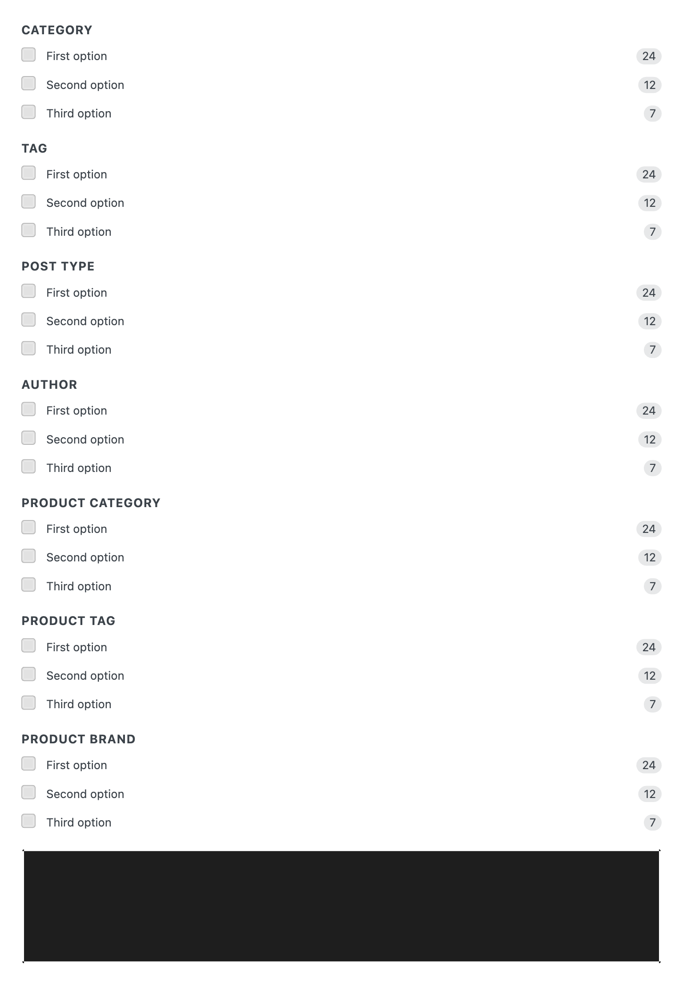
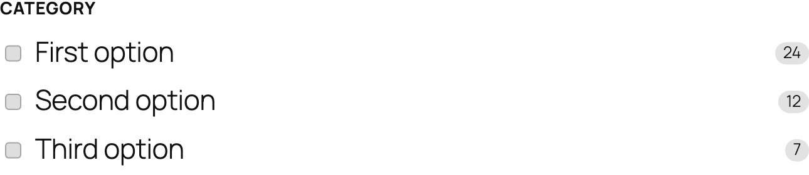
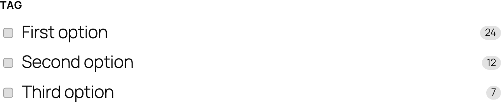
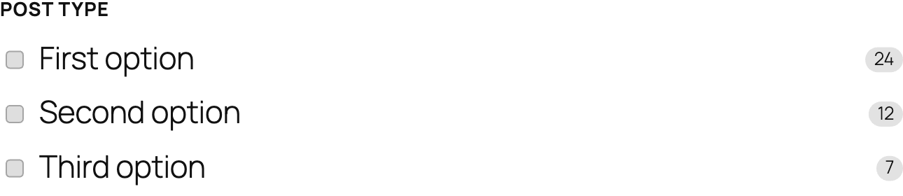
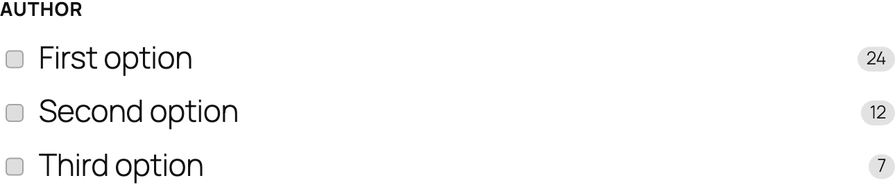
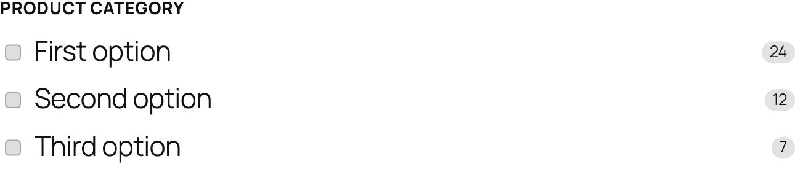
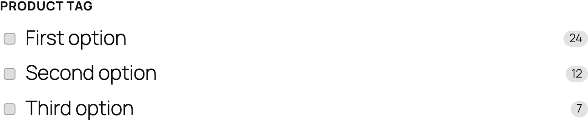
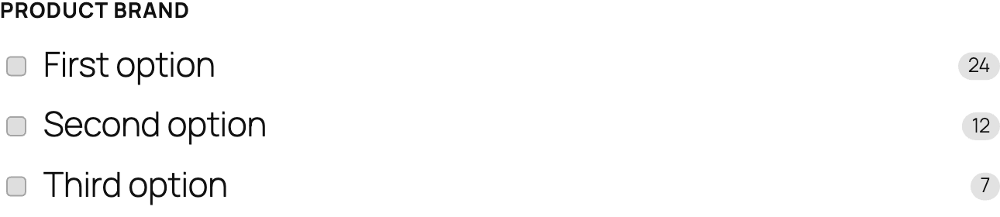

# Checkbox Filters

The Checkbox Filter block ships as a **family of named filters** — one per dimension you can filter by. Each one appears as its own card in the block inserter, with its own title and a sensible default label, so authors don't have to configure a generic "checkbox filter" before it does anything useful.

You'll see the following entries in the inserter:

- **Filter by Category** — for WordPress post categories
- **Filter by Tag** — for WordPress post tags
- **Filter by Post Type** — for content types (Post, Page, custom post types, etc.)
- **Filter by Author** — for post authors
- **Filter by Product Category** — for WooCommerce product categories
- **Filter by Product Tag** — for WooCommerce product tags
- **Filter by Product Brand** — for WooCommerce product brands (only appears when a `product_brand` taxonomy is registered, e.g. by WooCommerce Brands or recent bundled WC versions)
- **Filter by Custom Taxonomy** — for any other taxonomy registered on your site

All eight share the same code path, the same set of inspector settings, and the same visitor experience: a labelled list of checkboxes that updates results immediately when ticked. They differ only in **what** they filter by, the **default heading** they show visitors, and (for Custom Taxonomy) whether they need extra setup before they render anything.

> Add multiple Checkbox Filter blocks on the same page to let visitors narrow results by several dimensions at once — for example, a Category filter and an Author filter side by side. Each filter is independent, and all selections combine to refine the results.

## When to use these filters

Add any Checkbox Filter inside a **Filters** or **Collapsible Filters** container. The container holds the filter blocks; the individual filters do the work. You can mix and match — for example, Category + Tag + Author for a content site, or Product Category + Product Brand for a shop.

If you only need to **silently restrict** which post types are searchable (no visible UI for visitors), reach for the [Post Type Scope](../filter-post-type/README.md) block instead — that block shapes the result set without giving visitors any controls.

---

## The filters in detail

### Filter by Category

Lets visitors narrow results by the built-in WordPress **Category** taxonomy. Default heading: "Category". This is the most commonly added filter for blogs and content sites.

### Filter by Tag

Lets visitors narrow results by the built-in WordPress **Tag** taxonomy. Default heading: "Tag". Pair with Category for the classic two-axis content filter.

### Filter by Post Type

Lets visitors choose which **content types** to include — for example, Posts, Pages, or custom post types like "Documentation" or "Product". Default heading: "Post Type". Use this when the same search page should return mixed content and visitors should pick what kinds of result they care about.

### Filter by Author

Lets visitors narrow results by **post author**. Default heading: "Author". Useful for multi-author blogs and editorial sites.

### Filter by Product Category

Lets visitors narrow results by the WooCommerce **Product Category** (`product_cat`) taxonomy. Default heading: "Product Category". Only meaningful on sites that use WooCommerce.

### Filter by Product Tag

Lets visitors narrow results by the WooCommerce **Product Tag** (`product_tag`) taxonomy. Default heading: "Product Tag".

### Filter by Product Brand

Lets visitors narrow results by the **Product Brand** (`product_brand`) taxonomy. Default heading: "Product Brand". This variation only appears in the inserter when a `product_brand` taxonomy is actually registered on the site (provided by WooCommerce Brands, Perfect Brands, or recent bundled WooCommerce versions). On sites without it, the option is hidden so authors don't accidentally drop in a filter that renders nothing.

### Filter by Custom Taxonomy

A generic version that lets you target **any other registered taxonomy** — for example, "Genre", "Series", or a plugin-provided taxonomy. Default heading: empty (the inspector requires you to enter one).

When you first insert this variation, the block shows a placeholder asking you to pick a taxonomy in the block settings. Until you do, **nothing is rendered on the front end**. After picking a taxonomy and (recommended) typing a heading, the filter behaves exactly like the built-in variations.

The taxonomy picker lists every public custom taxonomy on the site, but **excludes** the five with their own dedicated variations (Category, Tag, Product Category, Product Tag, Product Brand) — use those entries directly rather than re-creating them through Custom Taxonomy.

---

## Common settings

These appear in the block's settings panel and behave the same way for every variation above.

### Filter type

The variation selector. Switching the filter type here is equivalent to deleting the block and inserting a different variation — it's there so you don't have to. (Switching to Custom Taxonomy will then ask you to pick a taxonomy.)

### Filter heading

The label shown above the checkbox list. Each built-in variation has a sensible default ("Category", "Tag", etc.). Customise it to match your site's terminology — for example, rename "Tag" to "Topic" or "Category" to "Department". The Custom Taxonomy variation requires a heading, since there's no sensible default for an arbitrary taxonomy.

### Show result counts

Shows the number of results next to each option (e.g. "Technology (42)"). Enabled by default. Turn it off for a cleaner look if counts aren't useful to your visitors.

### Maximum number of options

The maximum number of checkbox options to display. Defaults to 10. Lower this (e.g. 5) to keep the filter panel short, or raise it (up to 50) to expose more choices.

### Sort order

| Option | Description |
|--------|-------------|
| **Most results first** (default) | Counts descending — surfaces the most popular options at the top |
| **Alphabetical** | Options listed A–Z — predictable for visitors who know what they're looking for |

## Tips

- For most content sites, drop in **Filter by Category** + **Filter by Tag** — these are the dimensions visitors most commonly want.
- Use **Alphabetical** sort when terms have roughly equal counts and visitors know the names they're looking for (e.g. country names, brands).
- Use **Most results first** when you want to surface the most content-rich categories first.
- For custom taxonomies (e.g. "Genre", "Series"), use **Filter by Custom Taxonomy** and pick the slug from the inspector — and remember to set a heading.
