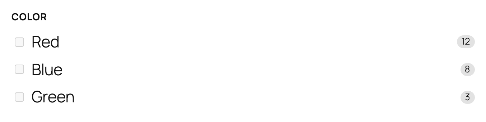
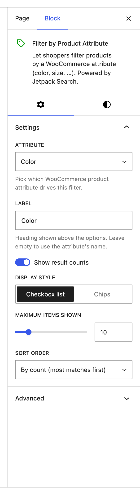

# Filter by Product Attribute

The Filter by Product Attribute block lets shoppers narrow product results by one of your store's WooCommerce **product attributes** — Color, Size, Material, Style, or any other attribute you've set up. Each block instance covers one attribute, and you can drop in as many as you need (Color + Size + Material, side by side).

**Editor preview:**

**Settings panel:**

> Front-end view requires WooCommerce + product-attribute data; the block renders just the heading on a freshly-installed store until products have been tagged with attribute values.

## When to use this block

Use Filter by Product Attribute for any shop where the same product comes in variations that shoppers want to filter by — clothes by Size, paint by Finish, plants by Light requirement, and so on. Add one block per attribute you want exposed.

This block only appears in the inserter on sites that use WooCommerce **and** have at least one product attribute registered. If you don't see it, you haven't set up any attributes yet. Visit **Products → Attributes** in your WordPress admin to create one (Color, Size, etc.), and then the block becomes available.

## Setting up the block

When you first add the block, it shows a placeholder asking you to pick an attribute. Open the settings panel and choose one from the **Attribute** dropdown — the list reflects every attribute registered in your WooCommerce admin.

You can place multiple Filter by Product Attribute blocks on the same page, each targeting a different attribute, to let shoppers filter by several dimensions at once.

## Available settings

### Attribute

Which WooCommerce product attribute drives this filter. Required — until you pick one, the block shows a placeholder and doesn't render on the front end. Pick the same attribute twice (in two separate blocks) and the second one is redundant; pick a different attribute in each block.

### Label

The heading shown above the options. Leave blank to use the attribute's name from WooCommerce (e.g. "Color"). Override it when you want a friendlier or more specific phrasing — for example, change "Material" to "Made from".

### Show result counts

Shows the number of matching products next to each option (e.g. "Red (12)"). On by default. Turn it off for a cleaner look if counts distract from the values themselves.

### Display style

Switch between two visual treatments:

| Option | Description |
|--------|-------------|
| **Checkbox list** (default) | One option per row with a tickbox — best for short lists and screen-reader-friendly UX |
| **Chips** | Compact pill buttons that wrap across multiple lines — best for short labels like sizes or colors, where vertical space is tight |

Pick **Chips** when the values are short (XS, S, M, L, XL) or when you want a more "tag cloud" feel. Stick with **Checkbox list** when the values are long phrases or when you have a lot of them.

### Maximum items shown

The maximum number of options to display. Defaults to 10. Lower it to keep the panel compact, or raise it (up to 50) to expose a longer list of attribute values.

### Sort order

| Option | Description |
|--------|-------------|
| **By count (most matches first)** (default) | Surfaces the most-stocked values at the top |
| **Alphabetical** | Predictable A–Z ordering, useful when shoppers know the value they're looking for (size names, country names, etc.) |

## Tips

- One block per attribute. Don't try to combine attributes in a single block — each one needs its own slot in your filter sidebar so shoppers can untangle their selections.
- Use **Chips** for Color and Size, **Checkbox list** for everything else. The chip layout reads beautifully for short tokens; long phrases like "Cold-pressed organic" break the visual rhythm.
- Pair this block with [Filter by Price](../filter-wc-price/README.md), [Filter by Rating](../filter-wc-rating/README.md), and [Filter by Stock Status](../filter-wc-stock-status/README.md) inside a [Product Filters](../filters-product/README.md) container for a complete shop sidebar.

## See also

- [WooCommerce features in Jetpack Search blocks](../WOOCOMMERCE.md) — the index of every WC-only block and the WC options on shared blocks (Checkbox Filter variations, Results List Product layout, Sort By price/rating orders, Active Filters price chip).
