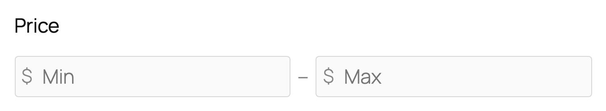
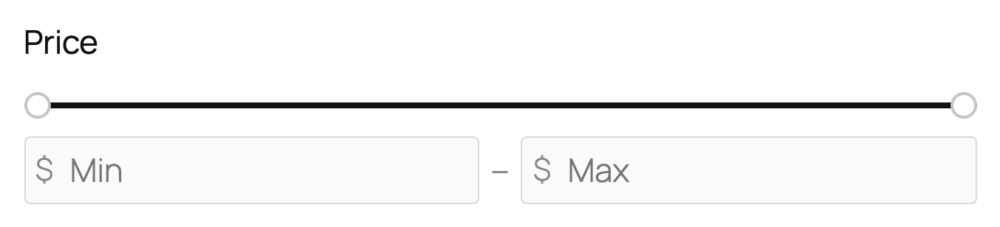
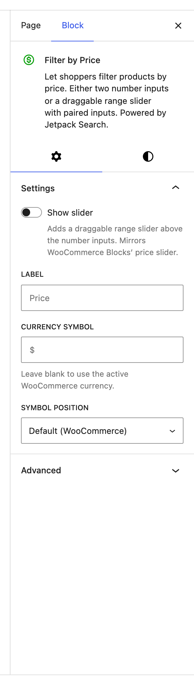
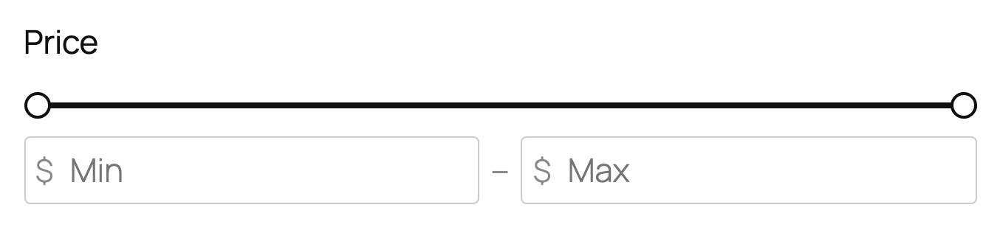

# Filter by Price

The Filter by Price block lets shoppers narrow product results to a price range. It ships in two flavors: a compact pair of **Min / Max** number inputs joined by a dash, and a wider version that pairs those inputs with a draggable range slider. Use whichever fits the space you have.

**Editor preview — inputs only (default):**

**Editor preview — with slider:**

**Settings panel:**

**Front-end view — inputs only:**

**Front-end view — with slider:**

## When to use this block

Use Filter by Price on any shop page where visitors are likely to have a budget in mind — category pages, search results, deal collections. It works best paired with the other product filters (Stock Status, Rating, Product Attribute) inside a [Product Filters](../filters-product/README.md) sidebar.

You only need this block on sites that use WooCommerce. It won't appear in the block inserter on sites without WooCommerce active.

## Picking a variation

Both variations appear in the block inserter as separate cards:

| Variation | What it is | Best for |
|-----------|------------|----------|
| **Filter by Price** (default) | Two number inputs side by side, joined by a dash | Narrow sidebars, mobile, when a slider would crowd the layout |
| **Filter by Price (Slider)** | Draggable range slider above the same number inputs | Wider sidebars, when shoppers want to "feel" the range visually |

You can switch a placed block between the two from the settings panel — toggle **Show slider** on or off. The choice you made in the inserter is just a starting point.

## Available settings

### Show slider

Switches between the two variations described above. Off (default) shows only the Min/Max number inputs. On adds a draggable range slider above them. The slider variation also exposes the **Slider range** panel described below.

### Label

The heading shown above the inputs. Defaults to **Price**. Override it if your store uses different terminology — for example, "Price range" or "Budget" — or in a non-English store where the auto-translated heading isn't quite right.

### Currency symbol

The currency mark shown inside the input fields. Leave blank to inherit the symbol from your store's WooCommerce currency setting (the `$` in a US store, `£` in a UK store, `€` in a French store, and so on). Override it only when you want to show something other than the store's configured currency — for example, an additional secondary currency hint.

### Symbol position

Whether the currency symbol appears **Before** the amount (`$ 50`) or **After** the amount (`50 €`). Defaults to inheriting from your store's WooCommerce settings, so you usually don't need to touch this.

## Slider range (slider variation only)

These options only appear when **Show slider** is on.

### Auto-detect range from store

When enabled (default), the slider's minimum and maximum thumbs are pinned to the actual cheapest and most expensive products in your catalog. This keeps the slider tight and useful: visitors can't drag past values that no product would match. The bounds refresh automatically as you add or remove products.

Turn this off if you want to lock the slider to a fixed range — for example, to focus shoppers on the `$0–$200` band even though your catalog has a few outlier `$2,000` items.

### Minimum / Maximum

The fixed bounds of the slider, in your store's currency. Only editable when **Auto-detect range from store** is off. Set Minimum lower than Maximum, or the slider won't render.

### Step

How granular the slider is — the smallest increment a shopper can drag it by. Defaults to **1** (whole-unit jumps). Increase to **5** or **10** for a coarser, "rounded number" feel.

## Tips

- For most shops, leave **Auto-detect range from store** on — it adapts automatically as your catalog grows.
- The inputs-only variation is the safer default for narrow sidebars and mobile. Adopt the slider variation only when you have at least ~300px of horizontal room to give it.
- Keep the **Label** short. "Price" is recognizable to every shopper and works in every screen size.
- Don't fiddle with **Currency symbol** unless you genuinely want a non-store currency in the UI — the WooCommerce-inherited default does the right thing for your store's locale.
