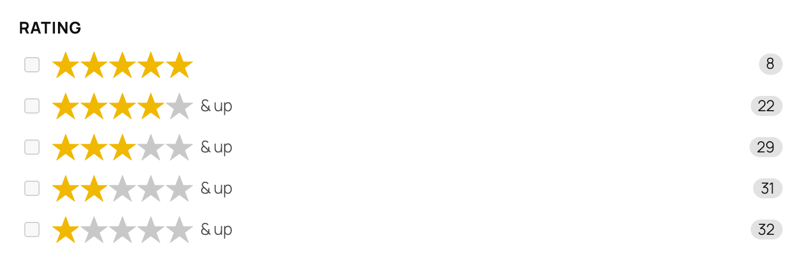
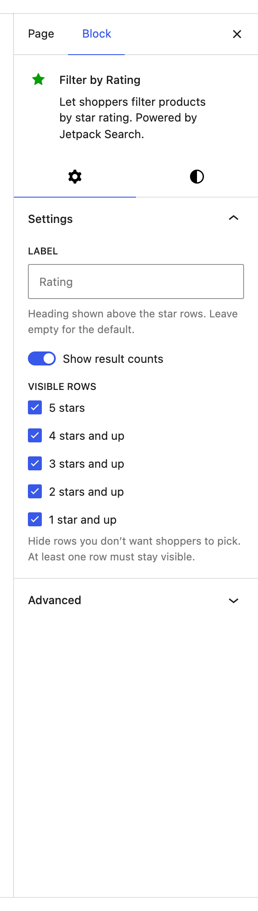
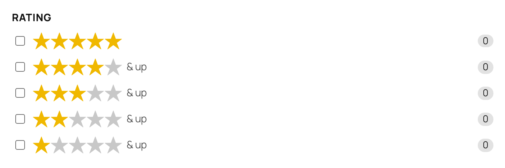

# Filter by Rating

The Filter by Rating block lets shoppers narrow product results by customer star rating. It shows five rows — 5 stars, 4 & up, 3 & up, 2 & up, and 1 & up — so visitors can pick whatever quality threshold they care about with a single click.

**Editor preview:**

**Settings panel:**

**Front-end view:**

## When to use this block

Add this block to any shop sidebar where product quality varies and shoppers want a quick way to skip lower-rated items. It pairs naturally with [Filter by Price](../filter-wc-price/README.md) and [Filter by Stock Status](../filter-wc-stock-status/README.md) inside a [Product Filters](../filters-product/README.md) container.

This block only appears in the inserter on sites that use WooCommerce.

## How shoppers read the rows

Each row is a **threshold**, not an exact rating:

| Row | Means |
|-----|-------|
| ★★★★★ | Products with exactly five stars |
| ★★★★ & up | Four stars or better |
| ★★★ & up | Three stars or better |
| ★★ & up | Two stars or better |
| ★ & up | Any rated product |

This is the conventional pattern shoppers already know from large retailers, so it doesn't need explanation in the UI. The count beside each row is the number of products that clear that threshold — which is why the counts always grow as you go down the list.

## Available settings

### Label

The heading shown above the rows. Defaults to **Rating**. Customize it to match your store's language — for example, "Customer rating" or "Review score".

### Show result counts

Shows the number of products matching each threshold (e.g. "★★★★ & up · 22"). On by default. Turn it off if your sidebar feels visually busy or if the counts don't help your shoppers decide.

### Visible rows

Choose which of the five star rows shoppers see. By default all five are visible. Hide rows when they don't make sense for your catalog — for example, hide **★ & up** and **★★ & up** to encourage shoppers to focus on well-rated products and not even consider the bottom of the range.

At least one row must stay visible — the block won't let you hide all five.

## Tips

- The default setting (all five rows, counts on) is usually the right answer. Tune **Visible rows** only when you have a clear reason to nudge shoppers toward a quality band.
- The "& up" wording is intentional — it reflects how shoppers actually think about ratings ("at least four stars"). Don't try to relabel rows individually.
- If most products in your store have similar ratings, the rating filter isn't doing useful work. Consider dropping it in favor of [Filter by Price](../filter-wc-price/README.md) or [Filter by Product Attribute](../filter-wc-attribute/README.md), where the buckets actually separate things.

## See also

- [WooCommerce features in Jetpack Search blocks](../WOOCOMMERCE.md) — the index of every WC-only block and the WC options on shared blocks (Checkbox Filter variations, Results List Product layout, Sort By price/rating orders, Active Filters price chip).
