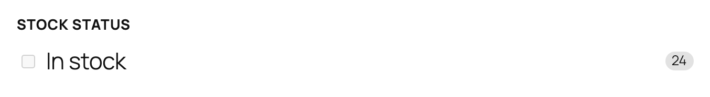
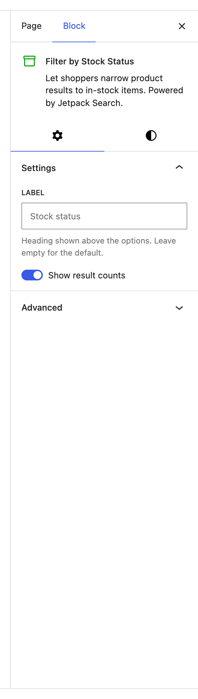

# Filter by Stock Status

The Filter by Stock Status block lets shoppers hide out-of-stock products with a single tick. It shows an **In stock** option with a count of matching products beside it.

**Editor preview:**

**Settings panel:**

**Front-end view:**

## When to use this block

Add this block to any shop sidebar where part of the catalog might be unavailable — stores with limited runs, perishables, made-to-order items, or seasonal stock. It pairs naturally with the other product filters inside a [Product Filters](../filters-product/README.md) container.

This block only appears in the inserter on sites that use WooCommerce.

## What it does

By default, search results include both in-stock and out-of-stock products so shoppers don't lose sight of items that might come back. When a visitor ticks **In stock**, results are narrowed to only items that are actually available to buy right now. Unticking returns them to the full set.

The count next to the option always reflects the current search query — so a shopper drilling down by category or price sees how many of those matching products are available.

## Available settings

### Label

The heading shown above the row. Defaults to **Stock status**. Override it for your store's voice — for example, "Availability" or "Show only available".

### Show result counts

Shows the number of in-stock products matching the current search. On by default. Turn it off for a cleaner look if the count distracts from the choice.

## Tips

- Don't pre-check **In stock** for your visitors. Most shoppers want to discover what exists in the catalog first; they'll opt in to "in stock only" when they're ready to buy.
- If your store almost never has out-of-stock products, this filter has very little signal — drop it and use the sidebar space for [Filter by Price](../filter-wc-price/README.md) or [Filter by Rating](../filter-wc-rating/README.md).
- This block is included by default in the [Product Filters](../filters-product/README.md) container — you don't need to add it separately when starting from that container.
