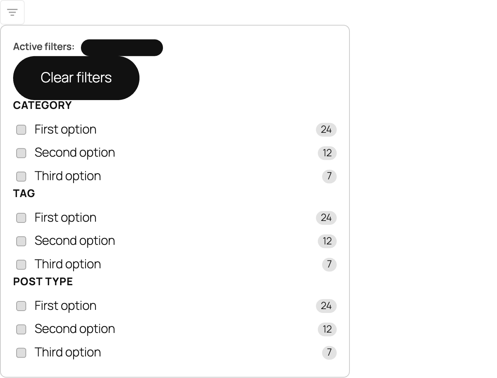

# Collapsible Filters

The Collapsible Filters block renders a compact button that opens a popover panel containing filter blocks. It keeps the filter interface out of the way until a visitor needs it.

## When to use this block

Use the Collapsible Filters block when you need filters in a compact layout — for example, a search bar in a page header or a narrow content area where a full sidebar won't fit.

When one or more filters are active, a badge on the button shows how many are currently applied, so visitors always know filters are in use even when the panel is closed.

If you have space for a permanent sidebar, use the [Filters](../filters/README.md) block instead.

## What's included by default

When you first add this block it contains:

| Default inner block | What it is |
|---------------------|------------|
| [Active Filters](../active-filters/README.md) | Pills showing currently applied filters. |
| [Clear Filters](../clear-filters/README.md) | Button that removes all active filters. |
| [Filter by Category](../filter-checkbox/README.md#filter-by-category) | Checkbox list for the WordPress Category taxonomy. |
| [Filter by Tag](../filter-checkbox/README.md#filter-by-tag) | Checkbox list for the WordPress Tag taxonomy. |
| [Filter by Post Type](../filter-checkbox/README.md#filter-by-post-type) | Checkbox list of content types. |

(No Author, Date, or Post Type Scope by default — keep the popover small.)

You can remove, rearrange, or add more filter blocks inside the popover from the block inserter. All [Checkbox Filter](../filter-checkbox/README.md) variations are available, plus Active Filters, Clear Filters, and Post Type Scope.

## What visitors see

- A small filter icon button in your layout.
- Clicking the button opens a popover panel with the filter blocks inside.
- Clicking outside the panel or pressing Escape closes it.
- When filters are active, a count badge on the button shows how many are applied.

## Accessibility

The trigger button is rendered with `aria-haspopup="dialog"` and `aria-expanded` reflects the panel state. The panel is a `role="dialog"` region. Visitors can close the popover with the Escape key.

## Styling

This block has no custom style settings beyond the standard block controls. Style the individual filter blocks inside the popover as needed.

## Tips

- Keep the number of filters inside the popover manageable — too many makes the popover tall and hard to use on mobile.
- Place **Active Filters** and **Clear Filters** at the top of the popover so visitors can quickly see and remove applied filters without scrolling.
- Pair this block with the **Search Input** block in a row for a compact search-bar layout.
