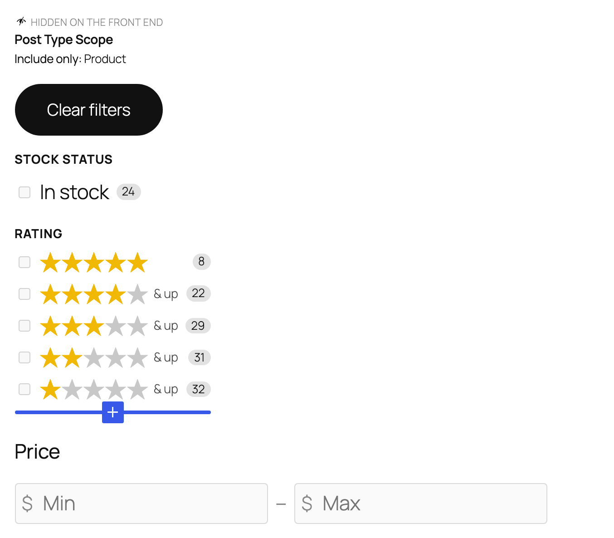
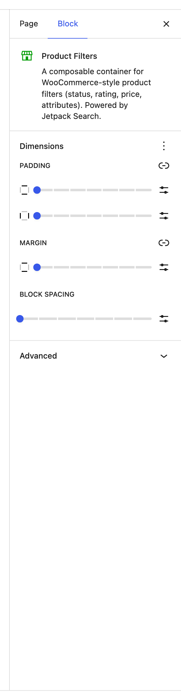
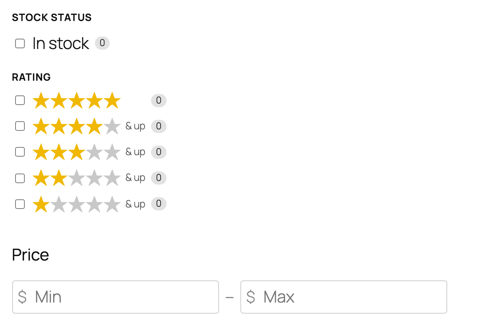

# Product Filters

The Product Filters block is a ready-made sidebar for shop pages. Drop it in and you immediately get a clean, vertical filter column wired up for WooCommerce — Stock Status, Rating, Price — plus a Clear button and an invisible scope that limits results to products only.

**Editor preview (default template):**

**Settings panel:**

**Front-end view:**

## When to use this block

Use Product Filters when you're building a shop page and you want a complete filter sidebar without picking and configuring each child block yourself. It's the fastest way to get a usable shop search experience on the page.

You can also start from the more general **Filters** block and add the WooCommerce-specific filters by hand — Product Filters is just a friendlier starting point.

This block only appears in the inserter on sites that use WooCommerce. If you're not on WooCommerce, reach for **Filters** instead.

## What's included by default

When you first insert this block, it comes pre-populated with these inner blocks (each can be removed, rearranged, or duplicated):

| Default inner block | What it is |
|---------------------|------------|
| **Post Type Scope** | An invisible constraint that limits results to **Product** only — keeps blog posts and pages out of the shop view. Doesn't render anything for visitors. |
| **Clear Filters** | Button that removes all active filters at once. |
| [Filter by Stock Status](../filter-wc-stock-status/README.md) | "In stock" toggle. |
| [Filter by Rating](../filter-wc-rating/README.md) | Star-rating threshold rows. |
| [Filter by Price](../filter-wc-price/README.md) | Min / Max price inputs. |

Authors can remove any of these freely. The **Post Type Scope** block has no visitor-facing UI, but it's doing useful work behind the scenes — leave it in unless you genuinely want the same panel to also surface non-product results.

## Adding more filters

Click the **+** icon at the bottom of the Product Filters block to insert any of these:

- [Filter by Product Attribute](../filter-wc-attribute/README.md) — for Color, Size, Material, etc. Add one per attribute.
- **Active Filters** — pills showing currently applied selections.
- Any **Checkbox Filter** variation — Product Category, Product Tag, Product Brand, or any custom taxonomy your store uses.
- **Filter by Date** — to filter by product publication date, useful for "new arrivals" sections.

## Styling

Use the standard block styling controls in the editor sidebar (spacing, padding, block gap) to tune how the sidebar sits on the page. Each child filter can be styled individually too.

## Tips

- Drop Product Filters into a sidebar column next to your **Search Results** block for the classic two-column shop layout.
- Add a [Filter by Product Attribute](../filter-wc-attribute/README.md) block for each attribute your shoppers actually filter by — Color and Size are the usual suspects.
- Resist the urge to stack every filter you can think of. A short, focused sidebar converts better than a long one. Three to five filters is the sweet spot.
- If your store doesn't carry stock-tracked products, remove [Filter by Stock Status](../filter-wc-stock-status/README.md) — an "In stock (0)" badge isn't useful when everything's always in stock.

## See also

- [WooCommerce features in Jetpack Search blocks](../WOOCOMMERCE.md) — the index of every WC-only block and the WC options on shared blocks (Checkbox Filter variations, Results List Product layout, Sort By price/rating orders, Active Filters price chip).
