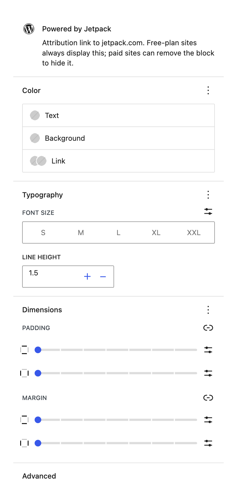
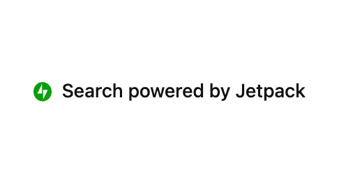

# Powered by Jetpack

The Powered by Jetpack block displays a small "Powered by Jetpack" attribution link at the bottom of your search results area.

**Editor preview:**

**Settings panel:** This block has no configurable options.

**Front-end view:**

## When to use this block

This block is included automatically when you insert the **Search Results** container.

**Free plan:** This attribution is required on the free Jetpack Search plan. If you remove this block from the results area, it will be added back automatically when the page renders.

**Paid plan:** You can remove or reposition this block freely. Removing it entirely will not cause it to reappear.

## Settings

This block has no configurable options beyond standard styling controls (color, typography, spacing) in the editor sidebar.

## Tips

- If you are on a paid plan and want to remove the attribution, simply select the block inside **Search Results** and delete it.
- You can move this block to the top of the results area or elsewhere in the container using the block mover controls.
