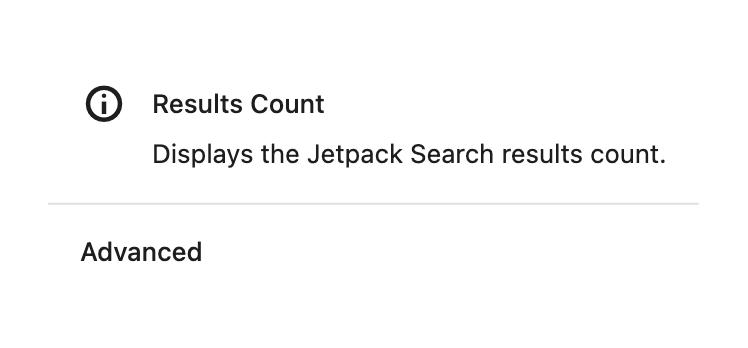
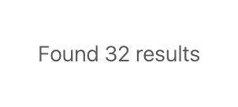

# Results Count

The Results Count block shows visitors how many results were found for their search — for example, "1,234 results for 'wordpress'".

**Editor preview:**

**Settings panel:** This block has no configurable options.

**Front-end view (after a search returns results):**

## When to use this block

This block is included automatically when you insert the **Search Results** container. It's typically placed beside the **Sort By** block so the count and sort control appear at opposite ends of a row above the results list.

## Settings

This block has no configurable options. Use the standard block styling controls in the editor sidebar (color, typography, spacing) to adjust how the count text looks.

## What visitors see

- Before a search is typed: the count area is empty.
- When a search is in progress: shows "Searching…"
- After results load: shows the total result count, e.g. "42 results for 'headless'".

## Tips

- You can remove this block from the **Search Results** container if you prefer not to show a count.
- Pair it with the **Sort By** block in a flex-row group to create a clean header row above the results.
