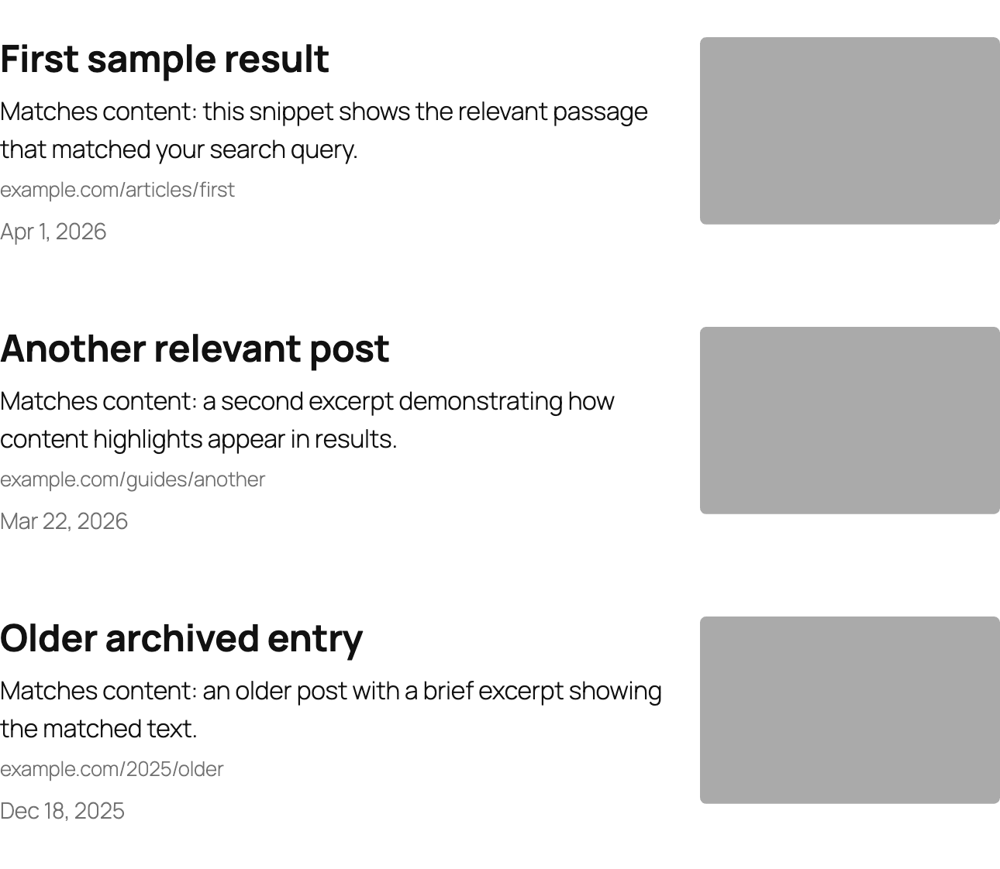
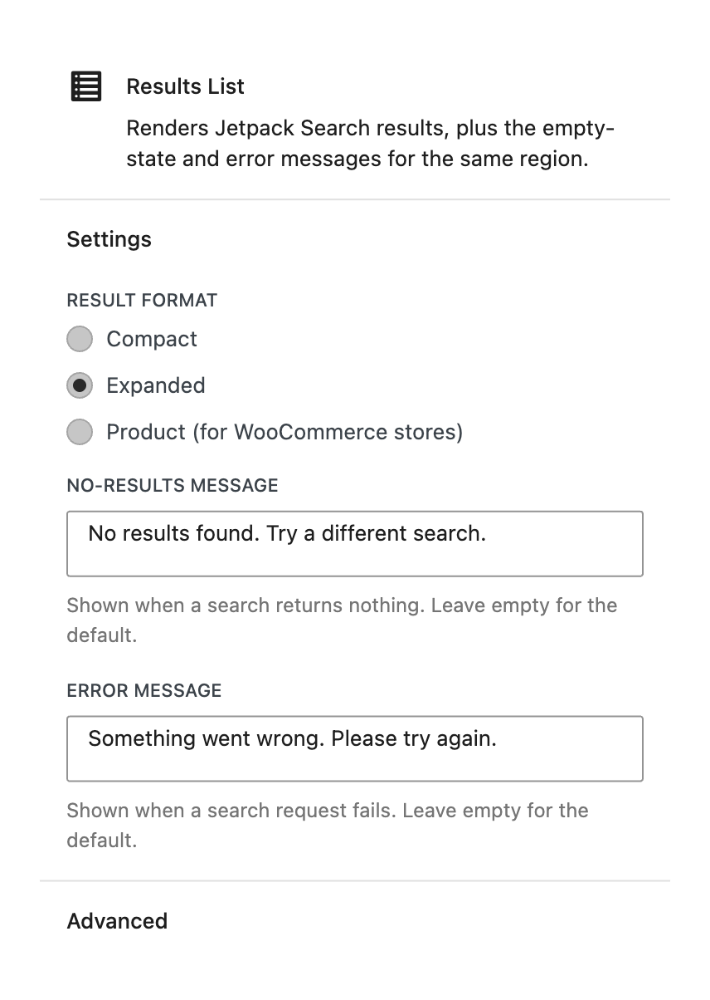
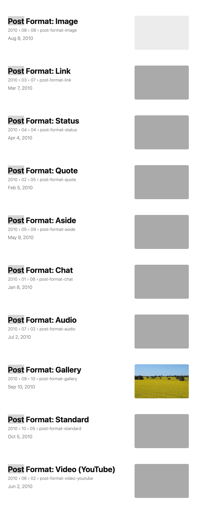

# Results List

The Results List block displays the individual search result items returned by Jetpack Search. It also shows a message when a search finds nothing, and an error message if something goes wrong.

**Editor preview:**

**Settings panel:**

**Front-end view:**

## When to use this block

This block is included automatically when you insert the **Search Results** container. You generally don't need to add it separately, but you can remove it and re-add it from the inserter if you need to reposition it within the container.

## Available settings

### Layout

Choose how much detail each result shows:

| Layout | What it displays |
|--------|-----------------|
| **Expanded** (default) | Thumbnail image, title, excerpt, URL path, and date |
| **Compact** | Title and date only — good for dense results lists or sidebars |
| **Product** | Thumbnail image, title, price, and star rating — designed for WooCommerce shops |

### No results message

The text shown when a visitor's search returns zero results. Defaults to a translated "No results found" message if left blank. Customise this to match your site's tone — for example, "We couldn't find anything for that search. Try different keywords."

### Error message

The text shown if a search request fails (for example, due to a network issue). Defaults to a translated error string if left blank.

## Tips

- Use the **Compact** layout when results appear in a narrow sidebar or a space-constrained area.
- Use the **Product** layout for WooCommerce stores where visitors expect to see prices and ratings at a glance.
- Keep your "no results" message friendly and actionable — suggest broadening the search or checking spelling.
