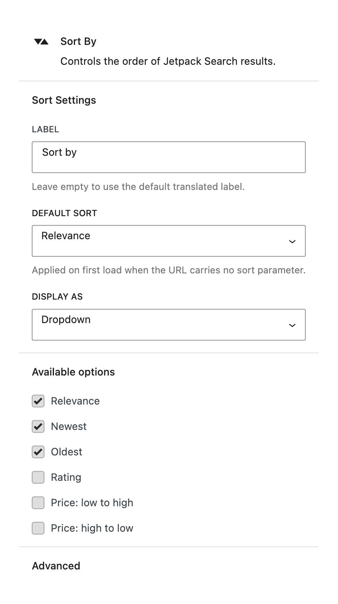
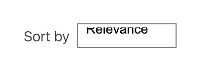

# Sort By

The Sort By block lets visitors change the order in which search results are displayed. You choose which sort options to offer and which one is selected by default.

**Editor preview:**

**Settings panel:**

**Front-end view:**

## When to use this block

This block is included automatically when you insert the **Search Results** container. It's typically placed beside the **Results Count** block at the top of the results area.

## Available settings

### Default sort order

The sort order applied when a visitor first arrives on the search page. Choose from:

| Option | Description |
|--------|-------------|
| **Relevance** (default) | Results are ordered by best match to the search query |
| **Newest** | Most recently published content appears first |
| **Oldest** | Earliest published content appears first |
| **Highest rated** | Highest WooCommerce product rating first |
| **Lowest price** | Cheapest WooCommerce product first |
| **Highest price** | Most expensive WooCommerce product first |

### Sort options to show

Choose which sort options are available to visitors. You can include as many or as few as you like — at least one must always remain. For a blog, offering Relevance and Newest is usually enough. For a shop, you might add Lowest price and Highest price.

### Display style

Choose how the sort control looks:

| Style | Description |
|-------|-------------|
| **Dropdown** (default) | A `<select>` menu — compact and familiar |
| **Radio buttons** | All options visible at once — good when there are only 2–3 choices |
| **Collapsible** | A compact button that opens a popover — saves space in tight layouts |

### Label

The text label that precedes the sort control. Defaults to "Sort by" if left blank.

## Tips

- For general content sites, **Relevance** is the best default — it puts the most useful result first.
- For WooCommerce stores, consider offering price-based options so shoppers can find deals quickly.
- If you only have two sort options, **Radio buttons** make both visible at a glance without needing a dropdown.
