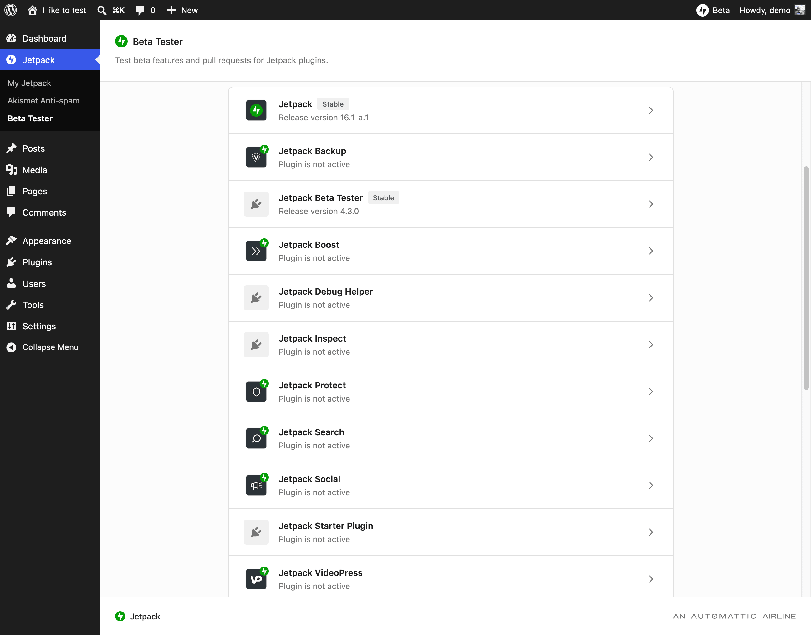

# Jetpack Beta Tester

This plugin can be used **alongside [the Jetpack plugin](https://wordpress.org/plugins/jetpack/)**, and will allow you run specific versions of Jetpack on your site:
- Bleeding Edge (`master` or `trunk`)
- Release Candidates (latest Beta releases)
- Feature branches ([branches currently being worked on in the Jetpack repository](https://github.com/Automattic/Jetpack/pulls))
- SVN Tags ([any existing tag in Jetpack's SVN repo](https://plugins.svn.wordpress.org/jetpack/tags/)): this allows you to install past versions of Jetpack on your site if necessary.

-------

## Quick Start

**Want to help us test out Jetpack?**

We'd love to have you! Just [download the latest version of this plugin](https://github.com/Automattic/jetpack-beta/releases) and install it alongside Jetpack, and we'll help keep you up to date with the very latest.

You can also join our Jetpack Beta mailing list at [jetpack.com/beta](https://jetpack.com/beta).

### How things work

* When installing a stable version of a plugin, the existing stable version will be replaced.
* When installing a development version of a plugin, it will be installed in its own directory next to the stable one (e.g. `wp-content/plugins/jetpack-dev/` is installed next to `wp-content/plugins/jetpack/`).
* Switching between stable and development versions of plugins only changes which of the two is active.
* Deactivating the Jetpack Beta plugin switches every plugin it manages back to its stable version when possible, then deletes the `<slug>-dev` directories. This means that if there is no stable version installed, the plugin will be removed entirely (with the exception of Jetpack Beta plugin, which prevents a self-delete).
* For mu-plugins things work a little differently (see [mu-plugin support](./docs/mu-plugin-info.md)).

### Contribute

If you find issues with this plugin, you can [report bugs here on GitHub](https://github.com/Automattic/jetpack/issues/new?assignees=&labels=%5BType%5D+Bug&template=bug-report.yml).

-------

### Deployment

Deployment is handled automatically via GitHub Actions upon tagging.

## Security

Need to report a security vulnerability? Go to [https://automattic.com/security/](https://automattic.com/security/) or directly to our security bug bounty site [https://hackerone.com/automattic](https://hackerone.com/automattic).

-------

## License

Jetpack is licensed under [GNU General Public License v2 (or later)](./LICENSE.txt).
